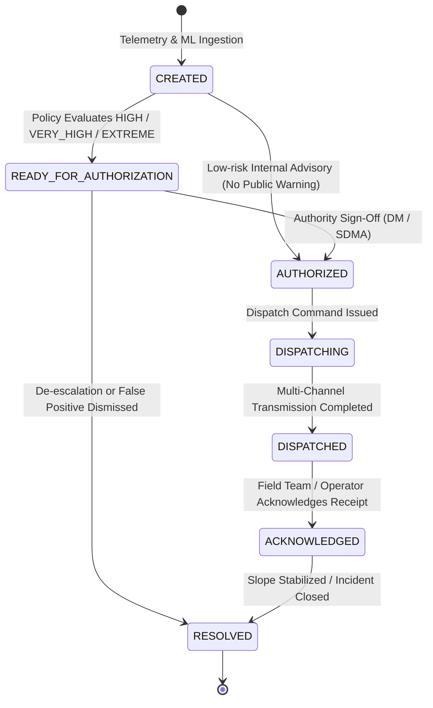

# PARVAT NETRA / PAHAD AI — Alert Lifecycle State Machine & Authority Governance

**Document Version:** 1.0  
**Phase:** 3.5 — Intelligent Alerting & Safety Governance  
**Classification:** Disaster-Intelligence Operational Standard  
**Standard:** Smart India Hackathon (SIH) Grade  

---

## 1. Lifecycle State Machine

Emergency notifications in PARVAT NETRA progress through an immutable, strictly ordered finite state machine. Transitions are logged to an append-only audit log with UTC timestamps and actor identities.



---

## 2. State Definitions & Invariants

| State | Description | Authorized Actions | Restricted Actions |
| :--- | :--- | :--- | :--- |
| **`CREATED`** | Raw prediction evaluated by PAHAD Alert Policy. Deduplication fingerprint computed. | Internal risk scoring, geofence radius resolution. | Cannot dispatch to public channels. |
| **`READY_FOR_AUTHORIZATION`** | High/Extreme risk breach identified. Awaiting designated authority review. | View explainability drivers, inspect 15 km impact zone, authorize, reject. | Cannot broadcast push or SMS. |
| **`AUTHORIZED`** | District Magistrate or SDMA Incident Commander has signed off. | Trigger multi-channel dispatch, select channels. | Cannot re-authorize. |
| **`DISPATCHING`** | Active broadcast fan-out to Push, SMS, CAP XML, and Edge Gateways. | Monitor delivery progress. | State is transient (sub-second). |
| **`DISPATCHED`** | Payloads sent to telecom networks (or simulated in `DRY_RUN`). | Delivery tracking, acknowledge alert. | Cannot modify alert parameters. |
| **`ACKNOWLEDGED`** | Field team, SDRF unit, or EOC operator confirms receipt. | Dispatch relief convoys, update evacuation status, resolve. | Alert is active in operations log. |
| **`RESOLVED`** | Slope stabilized, pore-pressure normalized, or threat passed. | Archive, post-incident review. | Terminal state: cannot dispatch or re-open. |

---

## 3. The Authority Approval Gate

> [!IMPORTANT]
> **Constitutional Safety Invariant:**  
> Autonomous machine learning predictions and physical Factor of Safety calculations NEVER trigger public civil alerts without human-in-the-loop authorization by an accredited authority.

1. **Eligible Authorizers**:
   - District Magistrate (DM) / Deputy Commissioner (DC)
   - State Disaster Management Authority (SDMA) Incident Commander
   - National Disaster Management Authority (NDMA) Duty Officer
2. **Authorization Contract**:
   `POST /api/notifications/<alert_id>/authorize` requires:
   - `actor`: Full name and title of authorizing officer.
   - `notes`: Justification referencing multi-signal agreement (e.g., "Authorized based on 3/3 signal concordance and Teesta basin rainfall exceedance").

---

## 4. Hysteresis & De-Escalation Protocol

To prevent oscillation between alert tiers caused by noisy rainfall sensors or fluctuating pore pressure:
1. **Escalation**: Immediate when threshold criteria and 2-of-3 signal concordance are met.
2. **De-Escalation**: Requires consistent readings over multiple consecutive cycles (configurable via `deescalation_hysteresis_cycles`, default: 3 cycles).
3. **Step-Down Damping**: Severe warnings are stepped down gradually (`EXTREME` $\to$ `VERY_HIGH` $\to$ `HIGH` $\to$ `MODERATE`) rather than abruptly collapsing to `LOW`.

---

## 5. Tamper-Evident Audit Logging

Every state transition writes an immutable `AlertAuditEntry` record:
```json
{
  "entry_id": "AUDIT-A4F791C2",
  "alert_id": "PN-ALERT-615691",
  "event": "ALERT_AUTHORIZED",
  "actor": "District Magistrate North Sikkim",
  "timestamp": "2026-09-09T21:46:23.493Z",
  "result": "AUTHORIZED",
  "channel": null,
  "dry_run": true,
  "details": {
    "notes": "Reviewed telemetry and geotechnical FoS breach."
  }
}
```
Audit trails are queryable via `GET /api/notifications/<alert_id>/delivery-status` and visible directly in the Notification Center UI.
