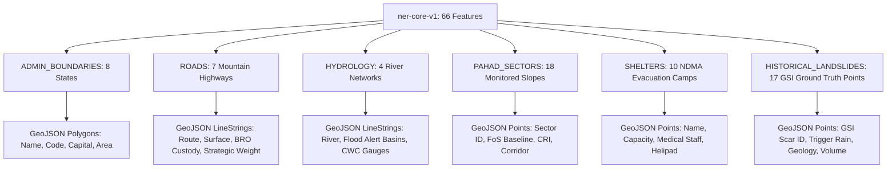

# PAHAD AI — Offline Operational Map Packages Specification
**PARVAT NETRA • NER Sentinel — Smart India Hackathon (SIH 26001)**
**Phase 3.2 Geospatial Package Standard**

---

## 1. Overview & Vector Mapping Philosophy

In a mountain disaster zone, attempting to cache millions of web-mercator PNG/raster tiles across the entire Northeast Region is computationally infeasible, consumes gigabytes of browser cache, and leads to frequent tile-loading failures ("gray grid / missing map" syndrome).

**PARVAT NETRA** adopts a **Structured Vector Packaging Standard**:
- Vector layers store exact geometry (Point, LineString, Polygon) alongside rich operational attributes (road criticality, shelter capacity, historical failure dates).
- Renders natively in Leaflet using SVG/Canvas rendering kernels without internet connectivity.
- Scales crisply at any zoom level without pixelation.
- Drastically reduces bundle size: the entire pre-bundled operational package covering all 8 NER states measures **52.1 KB**, rendering instantaneously even on 2G edge networks or totally disconnected laptops.

---

## 2. Vector Format Evaluation & Leaflet Integration

| Format | Storage Efficiency | Leaflet Integration | Offline Capability | Decision |
| :--- | :--- | :--- | :--- | :--- |
| **GeoJSON (Structured Layer Group)** | High (with normalized precision) | Native (`L.geoJSON()`), zero external dependencies | Storable directly in IndexedDB & Service Worker cache | **SELECTED (Core Standard)** |
| **TopoJSON** | Very High (shared arcs compressed) | Requires `topojson-client` library | Compact for complex polygon boundaries | **Supported (Secondary)** |
| **PMTiles** | Ultra-High (single-file pyramidal vector tiles) | Requires `pmtiles` Leaflet plugin + Web Workers | Excellent for continental-scale deep zoom | **Reserved for Phase 4** |
| **MBTiles** | High (SQLite container) | Requires SQLite-to-Wasm bridge in browser | Standard on native mobile (Flutter) | **Used in Mobile App** |

---

## 3. Pre-Bundled Core Package (`ner-core-v1`)

The platform ships out-of-the-box with `static/data/offline_core_package.json`. The application functions immediately upon repository cloning without requiring external database setups or live downloads.

### Package Identity & Integrity Metadata

```json
{
  "package_metadata": {
    "dataset_id": "ner-core-v1",
    "name": "NER Operational Base Map",
    "version": "1.0",
    "installed": true,
    "provenance": "[CACHED]",
    "total_features": 66,
    "size_bytes": 52142,
    "checksum_sha256": "75f4f3dcebc407d8672ab857af817bc45a0882610c35e49fda4dc727bc127350",
    "bounding_box": [88.0, 21.9, 97.4, 29.5],
    "created_at": "2026-09-09T14:26:44Z",
    "updated_at": "2026-09-09T14:26:44Z"
  }
}
```

### Layer Group Hierarchy & Feature Distribution



1. **`ADMIN_BOUNDARIES` (8 Features)**:
   - Polygons encompassing Sikkim, Assam, Arunachal Pradesh, Meghalaya, Manipur, Mizoram, Nagaland, and Tripura.
   - Styled with subtle boundary lines (`#475569`, stroke-width: 1.5, fill: `#0f172a` with opacity: 0.15).

2. **`ROADS` (7 Strategic Mountain Lifelines)**:
   - NH-10 (Siliguri – Gangtok Lifeline, Teesta Gorge corridor).
   - NH-717A (Strategic alternate bypass via Lava & Pakyong).
   - NH-310 (Gangtok – Nathu La border artery).
   - NH-515 (Assam – Arunachal border corridor).
   - NH-29 (Dimapur – Kohima lifeline).
   - NH-6 (Shillong – Silchar lifeline).
   - NH-27 (East-West corridor artery).

3. **`HYDROLOGY` (4 Major River Channels)**:
   - Teesta River, Rangeet River, Brahmaputra River, and Barak River.
   - Used for flash-flood and debris-flow runout tracking.

4. **`PAHAD_SECTORS` (18 Critical Monitored Hillslope Sectors)**:
   - Includes NH-10 29th Mile, Pagla Jhora, Dzongu, Chungthang, Lachen, Lachung, Mangan, Bhalukpong, Tawang, Kohima bypass.
   - Embeds baseline geotechnical factor of safety ($FoS$) and slope angles.

5. **`SHELTERS` (10 NDMA / SDRF Evacuation Facilities)**:
   - Pre-configured community centers with documented capacity, medical triage capability, and food relief storage.

6. **`HISTORICAL_LANDSLIDES` (17 Ground Truth Failure Scars)**:
   - Geological Survey of India (GSI) recorded events (e.g. 1968 Teesta flood landslides, 2023 South Lhonak GLOF triggers, Malbazar, Tindharia).

---

## 4. Default Map Load & Zero-Failure Invariant

When a user navigates to `/`:
1. **Online State**: The Leaflet map initializes using high-resolution raster tiles (CartoDB Dark Matter / ESRI World Imagery).
2. **Offline State**: If network connectivity is absent or tile requests fail with timeout:
   - The map suppresses tile errors and switches instantly to **Offline Vector Mode**.
   - Loads `/static/data/offline_core_package.json` directly from Service Worker cache or IndexedDB.
   - Renders state polygons, river networks, road corridors, and shelter points using Leaflet canvas vector renderers.
   - Displays status: **`OFFLINE OPERATIONAL MAP`**.
   - **Result**: Zero blank gray grids, zero infinite loading animations, and 100% operational utility.

---

## 5. Professional Three-Tier Map Control Surface

All map controls are consolidated into a restrained, national-emergency authority control surface:

```
+-----------------------------------------------------------+
|  MAP CONTROL CONSOLE                                      |
+-----------------------------------------------------------+
|  [BASEMAP]                                                |
|  (o) Dark Slate        ( ) Topographic                    |
|  ( ) Terrain Relief    ( ) Satellite Imagery              |
|  ( ) Street Network                                       |
|  * When offline: Unavailable raster styles are disabled,  |
|    auto-selecting "Offline Vector Basemap".               |
+-----------------------------------------------------------+
|  [PAHAD AI LAYERS]                                        |
|  [x] Predictive Risk CRI   [x] Factor of Safety (FoS)     |
|  [x] Event Probability     [ ] Antecedent Rainfall (API)  |
|  [ ] InSAR Ground Motion   [ ] Historical Landslide Density|
+-----------------------------------------------------------+
|  [OPERATIONS INFRASTRUCTURE]                              |
|  [x] Strategic Highways    [x] Evacuation Shelters        |
|  [x] Medical Facilities    [ ] Bridges & Culverts         |
+-----------------------------------------------------------+
```

### Map Style Switcher Offline Behavior
- When the browser loses network connectivity:
  - Online raster options (`Satellite`, `Street`, `Topographic`) are visually dimmed (`opacity: 0.5; pointer-events: none;`).
  - An inline badge appears: `[Offline operational map active]`.
  - The map will never attempt to request non-existent remote tiles.

---

## 6. Cryptographic Package Verification Protocol

The [`static/js/offline_manager.js`](file:///c:/Users/dimpu/Downloads/PARVAT_NETRA_PAHAD_AI_FIRST/silly-fermi/static/js/offline_manager.js) module verifies map package integrity using the browser's hardware-accelerated Web Crypto API:

```javascript
// Verification algorithm in offline_manager.js
async function verifyPackageChecksum(packageJson, expectedSha256) {
    const encoder = new TextEncoder();
    const data = encoder.encode(JSON.stringify(packageJson));
    const hashBuffer = await crypto.subtle.digest("SHA-256", data);
    const hashArray = Array.from(new Uint8Array(hashBuffer));
    const calculatedHash = hashArray.map(b => b.toString(16).padStart(2, "0")).join("");
    return calculatedHash === expectedSha256;
}
```

If package tampering or corruption is detected:
- The package is marked as `[TAMPERED / CORRUPT]`.
- The user is alerted with a cryptographic mismatch notice.
- Fallback safely reverts to the factory pre-bundled package in the Service Worker precache.
