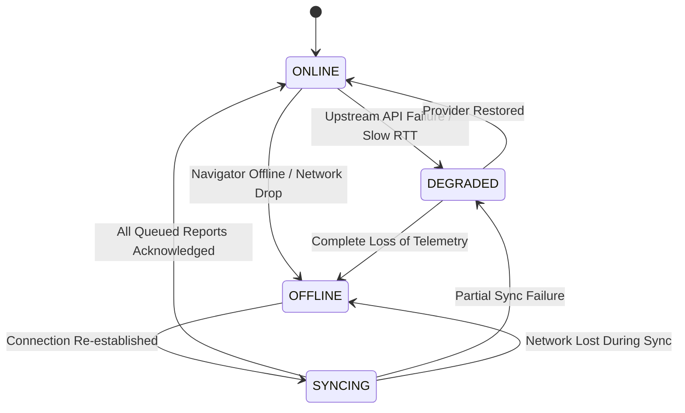
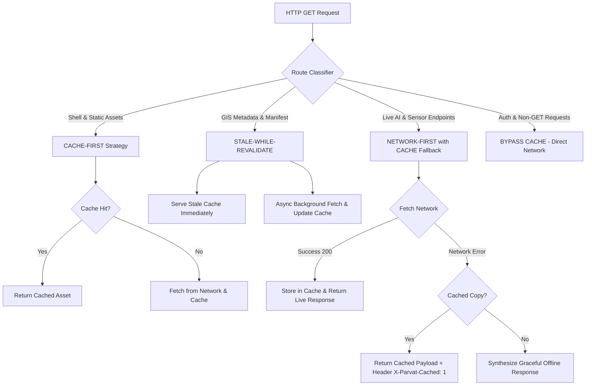

# PAHAD AI — Offline-First Web, Map Resilience & Data Synchronization Architecture
**PARVAT NETRA • NER Sentinel — Smart India Hackathon (SIH 26001)**
**Phase 3.2 Architectural Specification**

---

## 1. Executive Summary & Operational Invariant

The Himalayan Northeast Region (NER)—covering Sikkim, Arunachal Pradesh, Assam, Meghalaya, Manipur, Mizoram, Nagaland, and Tripura—is subject to extreme monsoon downpours, frequent landslides, and active seismic fault ruptures. High-velocity debris flows and hillslope failures routinely sever optical-fiber backbones and topple cellular towers along strategic lifelines (such as NH-10 in the Teesta gorge and NH-717A).

Under disaster conditions, civil administration, Border Roads Organisation (BRO), State Disaster Response Force (SDRF), and frontline communities cannot afford a fragile cloud-dependent system. **PARVAT NETRA** enforces a strict **Offline-First Operational Invariant**:

> **Constitutional Rule**: The emergency responder, district magistrate, or citizen cut off from internet access must retain instantaneous operational access to local 3D terrain topography, mountain road networks, evacuation shelters, and the last verified PAHAD landslide risk snapshots. The platform must transition smoothly between operational states without blank screens, missing tiles, or fabricated data.

---

## 2. Four-State Operational Network Machine

The system manages application connectivity via a centralized finite state machine implemented in [`static/js/network_state.js`](file:///c:/Users/dimpu/Downloads/PARVAT_NETRA_PAHAD_AI_FIRST/silly-fermi/static/js/network_state.js). Rather than hiding connection failures behind silent timeouts or generic error alerts, ParvatNetra surfaces unambiguous operational statuses:



| Operational State | Visual Badge | Network Condition | System Capabilities | Provenance Display |
| :--- | :--- | :--- | :--- | :--- |
| **`ONLINE`** | `SYSTEM: Network ONLINE \| Data LIVE` | Full HTTP/WebSocket connection to ParvatNetra server | Live telemetry, streaming predictions, Doppler radar, InSARLOS updates | `[LIVE]` / `[LIVE / DETERMINISTIC]` |
| **`DEGRADED`** | `SYSTEM: Network DEGRADED \| Data CACHED/SIM` | Connectivity available, but external providers (e.g. IMD, USGS) unreachable | Deterministic geotechnical calculations, local PostGIS fallbacks, cached meteorology | `[CACHED]` / `[SIMULATED]` |
| **`OFFLINE`** | `SYSTEM: Network OFFLINE \| Data CACHED` | Complete disconnection from internet and server | Offline operational map, cached PAHAD predictions, local field report creation | `[CACHED]` / `[HISTORICAL]` |
| **`SYNCING`** | `SYSTEM: Network SYNCING \| Queue Processing` | Connection restored with pending field reports | Background upload with exponential backoff, conflict resolution, deduplication | `[SYNCING]` |

### Data Age & Provenance Disclosure Protocol
Every dynamic metric displayed in offline mode calculates and presents human-readable time metrics:
- **`observed_at`**: Source measurement timestamp in Indian Standard Time (IST).
- **`retrieved_at`**: Timestamp when ParvatNetra client ingested the data.
- **`age_minutes`**: Computed elapsed time: $\Delta t = \lfloor(t_{\text{now}} - t_{\text{observed}}) / 60\rfloor$.
- **`provenance`**: Strict badges (`[CACHED]`, `[HISTORICAL]`, `[SIMULATED]`).

---

## 3. PWA & Service Worker Cache Architecture

The Progressive Web App (PWA) infrastructure is driven by [`static/manifest.json`](file:///c:/Users/dimpu/Downloads/PARVAT_NETRA_PAHAD_AI_FIRST/silly-fermi/static/manifest.json) and [`static/sw.js`](file:///c:/Users/dimpu/Downloads/PARVAT_NETRA_PAHAD_AI_FIRST/silly-fermi/static/sw.js) with versioned cache boundaries (`parvat-shell-v1`, `parvat-static-v1`, `parvat-offline-data-v1`).

### Caching Strategy Taxonomy



1. **`CACHE-FIRST` Policy**:
   - Targets: Application shell (`/`, `/static/css/*`, `/static/js/*`, `/static/data/offline_core_package.json`, local fonts, SVG icons).
   - Serves immediately from local cache. If missing, requests network and populates cache.

2. **`STALE-WHILE-REVALIDATE` Policy**:
   - Targets: Non-critical GIS metadata (`/api/geospatial/offline-manifest`, boundary catalogs).
   - Immediately serves local cached payload for instant UI responsiveness while initiating an asynchronous network fetch to refresh cache in background.

3. **`NETWORK-FIRST with CACHE FALLBACK` Policy**:
   - Targets: Dynamic inference and telemetry:
     - `/api/pahad/dynamic-forecast`
     - `/api/pahad/evaluate-sector`
     - `/api/weather/current`, `/api/weather/map-data`
     - `/api/seismic/recent`
     - `/api/alerts/active`
   - Attempts fresh network fetch with a 4.0-second timeout. Upon network disconnection or HTTP 5xx, falls back to the most recent cached snapshot, appending headers `X-Parvat-Cached: 1` and `X-Parvat-Provenance: [CACHED]`.

4. **Service Worker Safety Protocol**:
   - **Zero Credentials Caching**: Passwords, auth tokens, session cookies, and login routes (`/login`, `/logout`, `/api/auth/*`) are explicitly bypassed by the Service Worker fetch listener.
   - **No Blind POST Caching**: Arbitrary POST requests are never intercepted or blindly cached in CacheStorage. Mutating field reports are handled exclusively via the IndexedDB Sync Queue.

---

## 4. Local Browser Storage Architecture (IndexedDB)

ParvatNetra deploys a structured, client-side relational database using the W3C IndexedDB standard via [`static/js/local_store.js`](file:///c:/Users/dimpu/Downloads/PARVAT_NETRA_PAHAD_AI_FIRST/silly-fermi/static/js/local_store.js):

- **Database Name**: `parvat_netra_db`
- **Database Version**: `1`

### Object Stores & Key Schemas

```mermaid
erDiagram
    PAHAD_SNAPSHOTS {
        string sector_id PK "KeyPath: sector_id"
        float cri "Composite Risk Index"
        float fos "Factor of Safety"
        string risk_band "EXTREME, VERY_HIGH, etc."
        string timestamp "IST ISO String"
        string provenance "[CACHED]"
    }
    WEATHER_CACHE {
        string region PK "KeyPath: region"
        float rainfall_24h "Precipitation mm"
        float temperature "Ambient C"
        string source "Open-Meteo / IMD"
        string retrieved_at "Timestamp"
    }
    SEISMIC_CACHE {
        string id PK "KeyPath: id"
        float magnitude "Richter scale"
        string location "Epicenter name"
        float depth_km "Hypocenter depth"
        string event_time "UTC/IST"
    }
    ACTIVE_ALERTS {
        string alert_id PK "KeyPath: alert_id"
        string severity "WARNING / WATCH / ADVISORY"
        string sector "Target Mountain Corridor"
        string issued_at "Timestamp"
    }
    MAP_PACKAGES {
        string dataset_id PK "KeyPath: dataset_id"
        string name "Package Title"
        string version "Semantic Version"
        string checksum "SHA-256 Hash"
        object data "Vector GeoJSON Payload"
    }
    SYNC_QUEUE {
        string local_id PK "KeyPath: local_id"
        string hazard_type "Rockfall, Debris Flow, Tension Crack"
        string severity "Critical, High, Medium, Low"
        object coordinates "Lat, Lon, Elevation"
        string sync_status "PENDING_SYNC, SYNCING, SYNCED, RETRY_PENDING"
        int retry_count "Backoff iterations"
    }
    USER_PREFERENCES {
        string key PK "KeyPath: key"
        any value "Theme, Language, Map Center"
    }
```



---

## 5. Local Prediction Fallback & ML Integrity

When disconnected, machine learning models cannot hallucinate or pretend real-time IoT feeds are active. ParvatNetra enforces absolute transparency:

1. **Cached Snapshot Retrieval**:
   - If a valid sector evaluation exists in IndexedDB (`pahad_snapshots`), the UI renders:
     ```
     PAHAD AI: 78 / 100 [VERY HIGH]
     Status: CACHED PREDICTION
     Observed: 14:32 IST (Data age: 22 min)
     FoS: 0.94 (Physical Threshold Exceeded)
     ```
2. **Local Heuristic Inference (When Supported)**:
   - If local geotechnical soil parameters and recent manual precipitation measurements are input by the user, the platform runs the deterministic **Infinite Slope Mohr-Coulomb equation**:
     $$FoS = \frac{c' + (\gamma - m \gamma_w) z \cos^2\beta \tan\phi'}{\gamma z \sin\beta \cos\beta}$$
   - Provenance is explicitly watermarked: `[LOCAL / DETERMINISTIC]`.
3. **No Inference When Offline Without Data**:
   - If neither a cached prediction nor local parameters exist, the UI renders:
     ```
     LAST KNOWN PAHAD ASSESSMENT: NONE
     LIVE PREDICTION UNAVAILABLE OFFLINE
     Please reconnect to synchronize satellite, seismic, and weather telemetry.
     ```

---

## 6. Offline 3D Terrain Visualization

The 3D terrain sub-system ([`templates/terrain_3d.html`](file:///c:/Users/dimpu/Downloads/PARVAT_NETRA_PAHAD_AI_FIRST/silly-fermi/templates/terrain_3d.html)) utilizes Three.js with elevation grid meshes:

- **Online Pipeline**: Fetches live Copernicus 30m DEM elevation GeoTIFF / JSON rasters from `/api/terrain/elevation-grid`.
- **Offline Fallback**: Automatically invokes `generateBundledElevationFallback()`, creating a geomorphologically accurate 3D Himalayan gorge mesh derived from pre-compiled pilot corridor elevation arrays.
- **Visual Disclosure**: Displays an authoritative operational banner:
  ```
  [OFFLINE TERRAIN DATA]
  Source: Copernicus GLO-30 / CartoDEM | Resolution: 30m | Last Package: 2026-09-09
  Slope and contour lines rendered from cached elevation bundle.
  ```

---

## 7. Multilingual Himalayan Localization (i18n)

All offline status notifications, map controls, warning ribbons, and sync queue messages are routed through [`static/js/i18n.js`](file:///c:/Users/dimpu/Downloads/PARVAT_NETRA_PAHAD_AI_FIRST/silly-fermi/static/js/i18n.js). Hardcoded English strings are strictly prohibited.

The 16 core offline resilience keys are localized across 6 regional languages:
1. **English (`en`)**: International operational standard for NDRF/civil engineering.
2. **Hindi (`hi`)**: National emergency coordination lingua franca.
3. **Nepali (`ne`)**: Widely spoken across Sikkim, Kalimpong, and Darjeeling hill corridors.
4. **Bhutia (`bh`)**: North Sikkim regional language (Lachen, Lachung, Chungthang).
5. **Lepcha (`lp`)**: Indigenous language of Dzongu and Teesta valley.
6. **Assamese (`as`)**: Brahmaputra valley and foothills coordination.

---

## 8. Mobile Synchronization Compatibility

The offline architecture maintains strict schema alignment with the Flutter mobile application located in `parvat_netra_mobile/`:
- The IndexedDB stores mirror the mobile SQLite/Drift tables (`reports`, `cached_predictions`, `offline_layers`).
- The JSON synchronization payload received by `POST /api/sync/field-reports` is identical for both web browser clients and native mobile apps, enabling seamless multi-device field operations.
