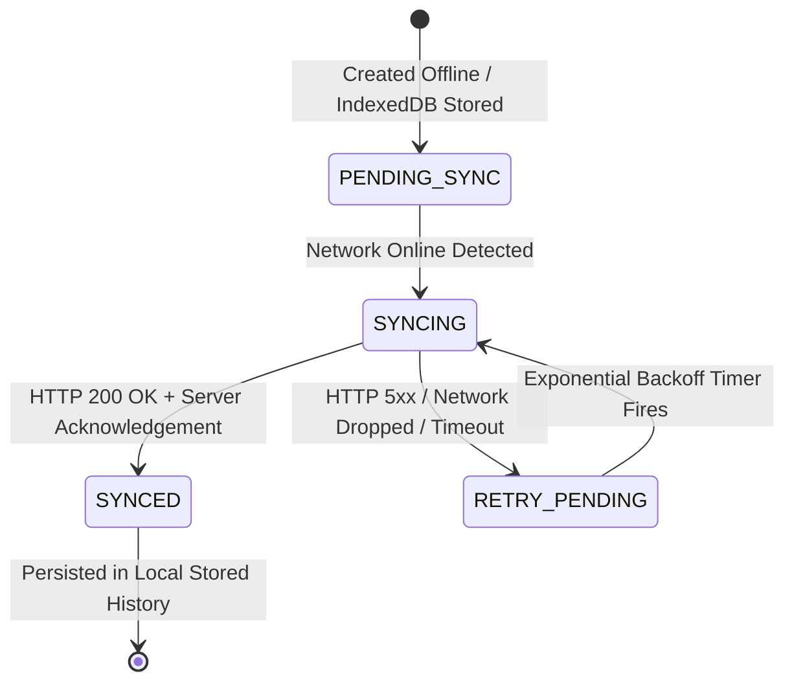

# PAHAD AI — Offline Field Reporting & Synchronization Protocol
**PARVAT NETRA • NER Sentinel — Smart India Hackathon (SIH 26001)**
**Phase 3.2 Data Synchronization Specification**

---

## 1. Protocol Objective & Field Context

During severe geohazard crises in the Himalayan valleys, frontline emergency responders, SDRF jawans, PWD engineers, and local panchayat scouts are the first to observe emerging slope instabilities:
- New tension cracks propagating across road asphalt.
- Turbid muddy runoff issuing from drainage culverts.
- Rockfall talus blocking critical evacuation choke points.

Because cellular networks are frequently offline in these gorges, field personnel must be able to log high-fidelity geocoded hazard reports on their mobile or laptop browsers **without network connectivity**. The report must never be lost, and must synchronize idempotently when connectivity is re-established.

---

## 2. Report Record Schema & Identity Invariant

Every field report record conforms to a bidirectional data contract shared between the frontend IndexedDB queue, the backend Python sync engine, and the Flutter mobile client:

| Field | Type | Description | Generation Source |
| :--- | :--- | :--- | :--- |
| **`local_id`** | `string` | Unique client-side identifier (e.g. `PN-OFFLINE-1788966321868` or UUIDv4) | Generated by Client |
| **`server_id`** | `integer` | Authoritative database primary key | Assigned by Server |
| **`tracking_ref`** | `string` | Formal emergency dispatch tracking code (e.g. `PN-REPORT-2026-0042`) | Assigned by Server |
| **`created_at`** | `string` | ISO 8601 UTC timestamp of original field observation | Client at submission |
| **`updated_at`** | `string` | ISO 8601 UTC timestamp of latest state transition | Client / Server |
| **`sync_status`** | `string` | Lifecycle state: `PENDING_SYNC`, `SYNCING`, `SYNCED`, `RETRY_PENDING` | Client Sync Engine |
| **`retry_count`** | `integer` | Number of failed upload attempts | Client Sync Engine |
| **`hazard_type`** | `string` | `Landslide`, `Rockfall`, `Debris Flow`, `Tension Crack`, `Road Blockage` | Reporter |
| **`severity`** | `string` | `Critical`, `High`, `Medium`, `Low` | Reporter |
| **`latitude`** | `float` | WGS84 Latitude from GPS receiver | Device GPS |
| **`longitude`** | `float` | WGS84 Longitude from GPS receiver | Device GPS |
| **`elevation`** | `float` | Barometric / GPS altitude in meters | Device Sensor |
| **`description`** | `string` | Detailed contextual description of the incident | Reporter |
| **`photo_data`** | `string` | Base64-encoded compressed image or image URI | Device Camera |
| **`provenance`** | `string` | Data honesty badge (`[OFFLINE_SUBMISSION]`, `[VERIFIED]`) | System Protocol |

---

## 3. Field Report State Lifecycle



1. **`PENDING_SYNC`**:
   - The user fills out the Field Report modal while disconnected.
   - The report is written synchronously into the IndexedDB `sync_queue` store via [`static/js/local_store.js`](file:///c:/Users/dimpu/Downloads/PARVAT_NETRA_PAHAD_AI_FIRST/silly-fermi/static/js/local_store.js).
   - UI confirms: *"Report saved locally. Queued for synchronization (PENDING_SYNC)."*

2. **`SYNCING`**:
   - Triggered automatically when the `window.addEventListener('online')` event fires, or when manual "Sync Now" is clicked.
   - Status in queue transitions to `SYNCING`.
   - Dispatches payload to batch endpoint `POST /api/sync/field-reports` or single endpoint `POST /api/reports/submit`.

3. **`SYNCED`**:
   - Upon receiving HTTP 200 with server verification, the client updates the record:
     - `sync_status = "SYNCED"`
     - Populates `server_id` and `tracking_ref`.
   - The report is moved from the active upload queue to the confirmed history catalog.

4. **`RETRY_PENDING`**:
   - If network cuts out mid-transfer or the server returns HTTP 503, the status updates to `RETRY_PENDING`.
   - The record remains safely stored in IndexedDB.
   - Retries with truncated exponential backoff.

---

## 4. Sync Engine Algorithms & Reliability Rules

The synchronization service is implemented in [`static/js/sync_manager.js`](file:///c:/Users/dimpu/Downloads/PARVAT_NETRA_PAHAD_AI_FIRST/silly-fermi/static/js/sync_manager.js) (client) and [`services/sync_service.py`](file:///c:/Users/dimpu/Downloads/PARVAT_NETRA_PAHAD_AI_FIRST/silly-fermi/services/sync_service.py) (server).

### A. Truncated Exponential Backoff with Jitter
To prevent thundering-herd congestion on mountain cellular towers following an outage, retry delays are calculated as:

$$T_{\text{delay}} = \min\left(T_{\text{max}}, T_{\text{base}} \times 1.5^{\text{retries}}\right) + \text{jitter}$$

- $T_{\text{base}} = 2.0\text{ seconds}$
- $T_{\text{max}} = 60.0\text{ seconds}$
- $\text{jitter} = \text{random}(0.0, 1.0)\text{ seconds}$

### B. Idempotency & Deduplication Contract
Unreliable mobile links often drop connections *after* the server has accepted a POST request but *before* the client receives the HTTP 200 response. Without deduplication, retries cause duplicate incident reports.

- **Rule**: Every request includes `local_id`.
- The server checks its synchronization registry before inserting:
  ```python
  if local_id and local_id in self._synced_registry:
      logger.info(f"[SyncService] Idempotent hit: {local_id} already synced.")
      existing = self._synced_registry[local_id]
      return {
          "status": "SYNCED",
          "local_id": local_id,
          "server_id": existing.get("server_id"),
          "tracking_ref": existing.get("tracking_ref"),
          "duplicate": True,
          "deduplicated": True,
          "message": "Report already synchronized."
      }
  ```
- **Guaranteed Result**: Zero duplicate incident dispatches, zero corrupted counters.

### C. Zero Data Loss Architecture
If the central PostgreSQL / PostGIS database cluster is unreachable when the server receives reports, `submit_report` catches the connection failure and routes the record to the in-memory/fallback synchronization registry. The client receives an authoritative acknowledgement and tracking code, preventing repeated client retries while staging the record for database persistence.

---

## 5. API Endpoints Specification

### Batch Synchronization: `POST /api/sync/field-reports`

#### Request Payload
```json
{
  "device_id": "CLIENT-WEB-BROWSER-8841",
  "client_timestamp": "2026-09-09T14:35:10Z",
  "reports": [
    {
      "local_id": "PN-OFFLINE-1788966321868",
      "hazard_type": "Landslide",
      "severity": "Critical",
      "latitude": 27.2458,
      "longitude": 88.5124,
      "elevation": 1280.0,
      "description": "Active debris flow across NH-10 near 29th Mile. Both lanes obstructed.",
      "created_at": "2026-09-09T14:32:00Z"
    }
  ]
}
```

#### Response Payload (HTTP 200 OK)
```json
{
  "status": "SYNCED",
  "synced_count": 1,
  "failed_count": 0,
  "results": [
    {
      "local_id": "PN-OFFLINE-1788966321868",
      "server_id": 1001,
      "tracking_ref": "PN-REPORT-2026-0001",
      "status": "SYNCED",
      "duplicate": false
    }
  ]
}
```

---

## 6. Offline Alert History Management

When operating offline, the application enables field teams to review previously issued disaster alerts stored in the IndexedDB `active_alerts` store:

- Displays alert severity band (`EXTREME`, `VERY_HIGH`, `HIGH`, `WATCH`).
- Displays target sector, issued timestamp, and official issuing agency (NDMA / SDMA).
- **Mandatory Offline Watermark**:
  ```
  [CACHED ALERT]
  Issued: 2026-09-09 11:30 IST (Age: 3h 12m)
  Source: NDMA / ParvatNetra Sentinel
  Offline notice: New emergency alert broadcasts are unavailable until network is restored.
  ```
