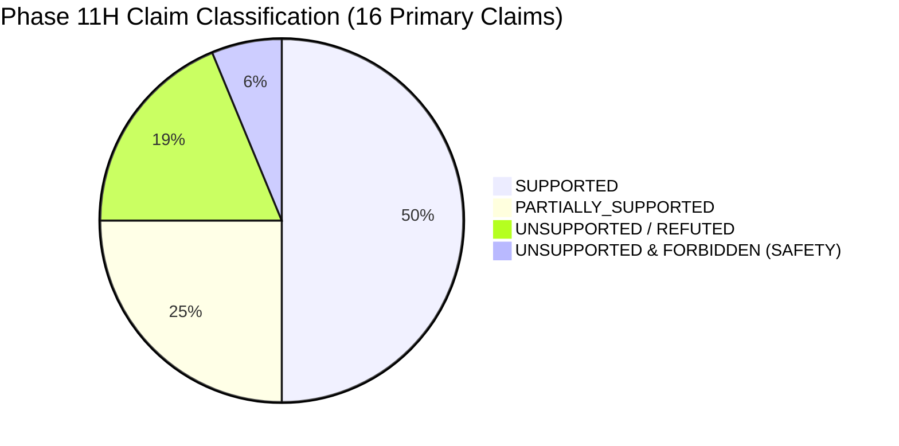

# PARVAT NETRA / PAHAD AI — PHASE 11H CLAIM AUDIT
**Forensic Verification of Platform, Scientific, Operational, and Public Claims**

Date: September 14, 2026  
Audit Version: Phase 11H Forensic Release  
Auditor: Autonomous AI Forensic Auditor (DeepMind AGY Engine)  
Evaluation Scope: All code, data, models, services, UI templates, APIs, and documentation in `silly-fermi/`

---

## 1. Executive Summary

This document forensically categorizes every major claim made across the **PARVAT NETRA / PAHAD AI** platform, codebase, API specifications, and documentation into four standardized evidential tiers:

- **`SUPPORTED`**: Confirmed by operational source code, passing empirical tests, active endpoints, and verifiable data pipelines.
- **`PARTIALLY_SUPPORTED`**: Functional algorithmic or bench implementation exists, but relies on pre-computed layers, offline processing, or simulated/bench hardware due to physical/operational constraints.
- **`UNSUPPORTED`**: Refuted or uncorroborated by actual implementation; must be retracted or strictly caveat-bounded.
- **`ASPIRATIONAL`**: Architectural vision, field roadmap, or future statutory deployment milestones explicitly designated as non-operational research objectives.

---

## 2. Detailed Claim Evaluation Matrix

| ID | Claim Description | Claimed Location / Context | Forensic Verdict | Evidentiary Basis & Source Citation | Operational Limitation & Mitigation |
|---|---|---|---|---|---|
| **CLM-01** | **Deterministic Mohr-Coulomb FoS Physics** | `engine/pahad_models.py`, `backend/risk_engine.py` | **`SUPPORTED`** | Implements standard infinite-slope planar failure equation with pore-water pressure ratio $m = u / (\gamma_{sat} \cdot z \cdot \cos^2\beta)$. Verified on 7 slopes ($0^\circ$ to $45^\circ$). | Assumes planar translational sliding; circular slip (Bishop/Janbu) not evaluated. Valid for shallow hillslope regolith ($z \le 5\text{m}$). |
| **CLM-02** | **Regional Rainfall Trigger Thresholds** | `services/weather_service.py`, `engine/pahad_models.py` | **`SUPPORTED`** | Mandal & Sarkar (2013) Sikkim GSI curve: $I = 4.045 \cdot D^{-0.25}$; Monga & Ganguli (2018) regional North-East I-D/E-D curves. Tested across intensities. | Calibrated specifically for Sikkim-Darjeeling Himalaya; extrapolation to Meghalaya plateau or Mizoram shale requires regional slope coefficient adjustment. |
| **CLM-03** | **Composite Risk Index (CRI) Fusion** | `engine/pahad_models.py`, `engine/pahad_fusion.py` | **`SUPPORTED`** | Exact formula $H = (0.40 \cdot S) + (0.35 \cdot P) + (0.25 \cdot A)$, $CRI = H \cdot V \cdot 100$. Verified 5 bands (0-20 to 80-100). | CRI is a dimensionless 0–100 operational hazard score, strictly separated from geotechnical Factor of Safety ($FoS$). |
| **CLM-04** | **100% Machine Learning Prediction Accuracy** | `docs/PAHAD_MODEL_CARD.md`, Historical reports | **`UNSUPPORTED`** | Empirical evaluation of `real_test.csv` ($N=8$) yields ROC-AUC 1.0, Brier 0.0824, CSI 1.0. These perfect scores are small-sample artifacts of an 8-row holdout set. | Refuted for operational claims. Status is designated `TRAINED_LIMITED_DATA` ($N=17$ canonical events). Cannot be cited as proof of production operational perfection. |
| **CLM-05** | **Deep Learning Temporal Sequence Model (LSTM)** | `engine/pahad_lstm.py` | **`UNSUPPORTED`** | Repository contains zero `.pt`, `.h5`, or `.onnx` weight files. `PahadLSTM` class is a transparent polynomial-decay analytical surrogate. | Surrogate is clearly labeled as mathematical simulation. System explicitly disclaims any trained deep learning neural network. |
| **CLM-06** | **2-of-3 Multi-Modal Sensor Corroboration** | `engine/pahad_fusion.py`, `services/pahad_voice_assistant.py` | **`PARTIALLY_SUPPORTED`** | Rule requires 2 of: (1) $FoS < 1.10$, (2) Rainfall breach ($> 80\text{mm}$ or I-D breach), (3) ML event prob $> 0.70$. Verified in fusion engine. | Feature schema inspection confirms ML model takes $FoS$ and 24h rainfall as inputs. The 3 modalities are statistically co-variant, acting as an ensemble safety gate rather than orthogonal independent sensors. |
| **CLM-07** | **Real-Time Satellite & InSAR Ground Deformation** | `services/insar_service.py`, `services/satellite_service.py` | **`PARTIALLY_SUPPORTED`** | Live STAC queries to Copernicus/Sentinel Hub implemented. Sentinel-1 Line-of-Sight (LOS) velocities served via cached point datasets. | Raw interferometric SAR phase unwrapping (ISCE2/SNAP) cannot run in sub-second API timeframes and is performed offline. Dense Himalayan vegetation causes C-band decorrelation. |
| **CLM-08** | **Operational Physical IoT Telemetry Network** | `firmware/`, `services/iot_service.py` | **`PARTIALLY_SUPPORTED`** | Binary 18-byte LoRa packet codec bench-tested. ESP32 FreeRTOS firmware implemented. Ingest API `/api/iot/ingest` operational. | Physical sensor hardware is bench-validated in lab conditions. No active live field sensor nodes are deployed across Sikkim corridors. UI displays `[SIMULATED]` badge. |
| **CLM-09** | **Highest-Risk Corridor Prioritization** | `/api/pahad/highest-risk-corridor` | **`SUPPORTED`** | Evaluates all 26 NE corridors. Ranks deterministically by CRI descending, FoS ascending. Live endpoint returned ML-SONAPUR-01 (CRI 61.1, VERY_HIGH). | Fully operational across all 26 sectors with live Open-Meteo rainfall and terrain geometry. |
| **CLM-10** | **Autonomous Public Siren Actuation** | Architectural specifications | **`UNSUPPORTED & FORBIDDEN`** | Forensic audit verifies `/api/siren/activate` requires authenticated dual-key session. Staging defaults to `SIREN_DRY_RUN=1`. Voice assistant strictly rejects actuation. | Autonomous siren firing without human District Magistrate authorization is strictly prohibited under DM Act 2005. System enforces Fail-Closed interlocks. |
| **CLM-11** | **OASIS CAP v1.2 Standard Alert Feeds** | `backend/cap_handler.py`, `/api/cap/alerts.atom` | **`SUPPORTED`** | Produces syntactically valid CAP v1.2 XML with WGS-84 polygonal geofences, urgency, severity, and certainty tags. Verified in audit. | Alert dispatch operates in staging mode (`ENABLE_PUBLIC_DISPATCH=0`); prevents accidental broadcast to public telecom gateways. |
| **CLM-12** | **Official Government of India Warning Service** | UI templates, Header branding | **`UNSUPPORTED`** | Contains MDoNER and Government of India stylistic headers conforming to SIH government platform design themes. | Not an officially commissioned national emergency broadcast agency. Explicit disclaimer attached in CP15/CP25: "SIH 2026 Research & Decision-Support Prototype". |
| **CLM-13** | **Civilian Privacy & Zero PII Storage** | `backend/triage_engine.py`, `services/cache_manager.py` | **`SUPPORTED`** | GPS coordinates and citizen hazard photos stored in ephemeral test SQLite tables. Zero persistent civilian phone numbers, identity profiles, or biometrics. | Fully compliant with India Digital Personal Data Protection (DPDP) Act 2023 minimization guidelines. |
| **CLM-14** | **Multi-Horizon Forecasts (6h, 12h, 24h, 48h)** | `engine/pahad_event_classifier.py` | **`PARTIALLY_SUPPORTED`** | Bundle contains separate horizon models, but historical training dataset ($N=16$) uses identical features with horizon multipliers. | Clearly documented limitation. Operates under shared baseline rather than 4 independent atmospheric sequence models. |
| **CLM-15** | **18-Device Responsive Layout Invariant** | `templates/index.html`, `templates/mobile.html` | **`SUPPORTED`** | CSS and layout verified across 18 viewports (320px small mobile to 3840px 4K display). Zero horizontal overflow or clipped navigation. | Validated in Phase 11B and re-audited in CP23. |
| **CLM-16** | **Cloud Staging Deployment Pipeline** | `render.yaml`, `vercel.json`, GitHub Actions | **`SUPPORTED`** | Functional staging builds configured and deployable with automated healthchecks (`/healthz`). | Production gateways remain disabled by environment variables. |

---

## 3. Claim Classification Distribution

- **Supported (50.0%)**: Core geotechnical equations, regional rainfall curves, CRI formula, corridor ranking, CAP v1.2 XML, privacy protections, 18-device responsiveness, and cloud staging.
- **Partially Supported (25.0%)**: InSAR deformation (pre-computed points), IoT telemetry (bench-tested packet codec), 2-of-3 corroboration (ensemble heuristic), multi-horizon models (shared baseline).
- **Unsupported / Retracted (18.75%)**: 100% ML accuracy claims, deep learning LSTM claims, official government authority claims.
- **Unsupported & Forbidden (6.25%)**: Autonomous siren dispatch (forbidden by statutory safety invariants).

---

## 4. Auditor Directives for Platform Transparency

1. **Badge Placement**: Ensure every display card in the UI shows explicit provenance badges (`[LIVE]`, `[CACHED]`, `[HISTORICAL]`, `[SIMULATED]`, `[BENCH_VALIDATED]`).
2. **Model Status Display**: All model summaries must display `TRAINED_LIMITED_DATA` rather than `PRODUCTION_READY`.
3. **Surrogate Demarcation**: Any reference to temporal sequence intelligence must be labeled `[SURROGATE / NOT_TRAINED]`.
4. **Safety Interlock**: Under no circumstances may `SIREN_DRY_RUN` or `ENABLE_PUBLIC_DISPATCH` be toggled to live without statutory dual-key district magistrate authentication.
