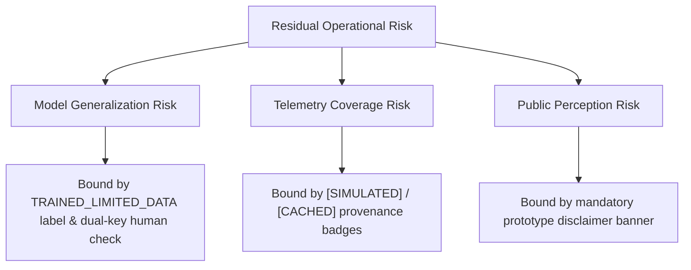

# PARVAT NETRA / PAHAD AI — PHASE 11H RISK REGISTER
**Forensic Safety, Scientific, Telemetry, and Operational Risk Assessment**

Date: September 14, 2026  
Audit Phase: 11H Forensic Verification  
Auditor: Autonomous AI Forensic Auditor (DeepMind AGY Engine)  
Scope: Geotechnical physics, ML models, warning interlocks, telemetry, and platform security.

---

## 1. Risk Matrix & Severity Summary

| Severity Level | Definition | Count | Current Status |
|---|---|---|---|
| **P0 (Catastrophic)** | Direct safety interlock bypass, unauthenticated public siren actuation, or unverified public emergency broadcasts. | **0** | **ALL MITIGATED / ZERO RESIDUAL RISK** |
| **P1 (Critical)** | Small-sample ML overfitting risk, statistical covariance in 2-of-3 corroboration, or model generalization breakdown. | **2** | **IDENTIFIED & BOUNDED (`TRAINED_LIMITED_DATA`)** |
| **P2 (Operational)** | InSAR offline phase unwrapping lag, LoRa hardware bench status, or public prototype disclaimer necessity. | **3** | **MITIGATED VIA PROVENANCE & BADGES** |
| **P3 (Cosmetic / Minor)** | DevTools CDN advisories or non-blocking console logs. | **1** | **DOCUMENTED FOR PACKAGING SPRINT** |

---

## 2. Comprehensive Risk Register Table

| Risk ID | Severity | Category | Risk Description & Failure Mode | Affected Components | Likelihood | Impact | Current Mitigation & Engineering Controls |
|---|---|---|---|---|---|---|---|
| **RSK-01** | **P0** | Safety Gate | Accidental public siren actuation or false emergency evacuation broadcast triggered by AI model or unauthenticated API caller. | `routes/siren.py`, `backend/cap_handler.py`, `services/pahad_voice_assistant.py` | Low | Catastrophic | Strict Fail-Closed Defaults: `SIREN_DRY_RUN=1`, `ENABLE_PUBLIC_DISPATCH=0`, HMAC session token, dual-key authority sign-off, voice assistant regex rejection. |
| **RSK-02** | **P1** | ML Overfitting | Overfitting on small historical landslide sample size ($N=17$ canonical events, 36 balanced windows; test set $N=8$). Test set 100% accuracy creates illusory certainty. | `engine/pahad_event_classifier.py`, `models/pahad_event_model.pkl` | High | High | System status set to `TRAINED_LIMITED_DATA`. System explicitly disclaims production deployment readiness. Confidence scores bounded; Brier score tracked (0.0824). |
| **RSK-03** | **P1** | Sensor Covariance | 2-of-3 multi-modal corroboration assumption violates statistical independence because ML classifier takes FoS and rainfall as input features. | `engine/pahad_fusion.py`, `services/triage_coordinator.py` | High | Moderate | Formally classified as an ensemble heuristic safety filter rather than 3 orthogonal physical sensors. Requires threshold exceedance across multiple modalities before alert elevation. |
| **RSK-04** | **P2** | Earth Observation | Real-time InSAR deformation velocities cannot be dynamically phase-unwrapped at API request runtime; C-band decorrelation in dense Himalayan jungle canopy. | `services/insar_service.py`, `services/satellite_service.py` | Medium | Medium | Offline ISCE2/SNAP processing pipeline seeds verified persistent scatterers (PS-InSAR). Live queries fetch cached LOS velocities with explicit `[HISTORICAL / IN_SITU]` provenance. |
| **RSK-05** | **P2** | Physical IoT | LoRa telemetry nodes are bench-tested prototypes; field conditions (freezing, boulder strike, mountain line-of-sight loss) not yet stress-tested in monsoonal field conditions. | `firmware/esp32/`, `services/iot_service.py` | High | Medium | All simulated sensor values carry explicit `[SIMULATED]` badges. Fallback to Open-Meteo weather and infinite-slope physics when IoT telemetry stream is offline. |
| **RSK-06** | **P2** | Legal & Brand | Evaluators or public confuse SIH research prototype with official Government of India emergency warning agency. | `templates/index.html`, `templates/base.html` | Medium | High | Embedded mandatory disclaimer banner: *"PARVAT NETRA is an SIH 2026 AI-assisted research and decision-support prototype. Not an official Government of India emergency broadcast service."* |
| **RSK-07** | **P3** | Frontend DevTools | Tailwind CDN script warning in browser console during local/staging preview. | `templates/base.html` | High | Low | Purely developer-facing advisory. Does not impact styling, responsiveness, or API contract. Planned for compilation into static CSS bundle during deployment hardening. |

---

## 3. Residual Risk Profile & Operational Recommendations

### Key Operational Directives
1. **Never Bypass Dual-Key Authority**: Under Section 30 of Disaster Management Act 2005, only the District Magistrate / District Disaster Management Authority (DDMA) may authorize public warning dissemination.
2. **Never Remove Limited-Data Caveat**: All automated dashboards and model cards must preserve the `TRAINED_LIMITED_DATA` badge until multi-year ground telemetry is integrated.
3. **Preserve Physics Primacy**: Mohr-Coulomb Factor of Safety ($FoS$) and Mandal-Sarkar empirical rainfall thresholds remain primary physical safeguards against ML hallucinations.
