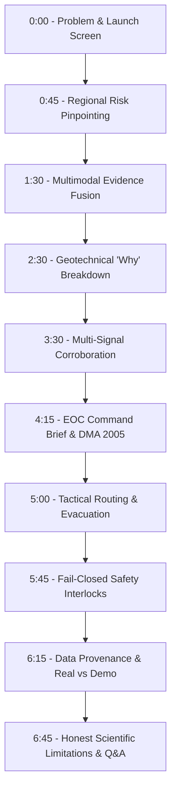

# PARVAT NETRA / PAHAD AI — PHASE 11K
## AUTHORITATIVE JUDGE DEMONSTRATION SCRIPT
**SIH 2026 — TOP-500 → TOP-5 EVALUATION JOURNEY**
**Target Duration:** 5 to 7 Minutes (Rehearsal Benchmark: 6 Minutes 15 Seconds)

---

### Core Operational Identity
> "PARVAT NETRA predicts where landslide conditions are becoming dangerous, explains why, and helps authorized authorities decide what to do next."  
> *It is an AI-assisted decision-support platform operating under the Disaster Management Act, 2005 — NEVER an autonomous emergency-warning AI.*

---

### Minute-by-Minute Demonstration Flow

---

#### Minute 0:00 – 0:45 | Section 1: The Problem & Start Screen
- **Screen:** Tactical Landslide Intelligence Console (`/`)
- **Action:** Open application, highlight the research prototype header, active time, and regional scope.
- **What Judge Sees:**
  - Obsidian slate theme (`#070B10`), crisp high-contrast telemetry.
  - Research Prototype disclaimer banner: `[RESEARCH PROTOTYPE] PARVAT NETRA is an SIH 2026 AI-assisted decision-support prototype.`
  - National GIGW 3.0 accessibility bar and Indian tricolor indicator.
  - Active monitoring indicator across 26 canonical corridors in the 8 North Eastern Region (NER) states.
- **What to Say:**
  > "Respected Judges, the North Eastern Himalayan Region faces a critical vulnerability: sudden, rain-induced landslides routinely sever strategic national corridors, stranding civilian supplies and military convoys along highways like NH-10. Traditional disaster management is purely reactive: responders arrive only after the mountain collapses.  
  >  
  > We present **PARVAT NETRA**, powered by **PAHAD AI**. It does not merely aggregate data, and it is not an autonomous alerting black box. PARVAT NETRA predicts where hillslope conditions are destabilizing, provides physical explainability of why, and equips District Magistrates with statutory decision intelligence before disaster strikes."
- **Evidence:** 26 monitored corridors spanning Sikkim, Arunachal Pradesh, Assam, Meghalaya, Manipur, Mizoram, Nagaland, and Tripura.
- **Safety Note:** Point to the research prototype disclaimer banner at the top of the screen.

---

#### Minute 0:45 – 1:30 | Section 2: Where is the Risk?
- **Screen:** Real-Time Regional Hazard Leaderboard (`/api/pahad/highest-risk-corridor`)
- **Action:** Click "Highest-Risk Corridor" or select `SK-NH10-KM48` from the corridor dropdown.
- **What Judge Sees:**
  - Real-time ranked corridor table.
  - Authoritative Top Corridor: `SK-NH10-KM48` (NH-10 Km 48, 29th Mile Sector, Pakyong District, Sikkim).
  - Composite Risk Index (CRI): `45.50` (Risk Band: `HIGH`).
  - Geotechnical Factor of Safety (FoS): `0.971` (Status: `CRITICAL`).
  - 24-Hour Rainfall: `33.3 mm`.
  - Event Probability: `4.97%` (`LOW` baseline probability).
- **What to Say:**
  > "Where is the risk right now? Across our 26 monitored NER corridors, the system dynamically calculates hazard severity. Currently, the highest-risk corridor is **NH-10 Km 48 at 29th Mile in Pakyong District, Sikkim**.  
  >  
  > Its Composite Risk Index stands at **45.50**, placing it in the **HIGH** risk band, while its calculated geotechnical Factor of Safety is **0.971**, breaching the critical limit-equilibrium threshold of 1.0. Notice that this is not hardcoded: our background engine ranks all corridors continuously based on real-time inputs."
- **Evidence:** Live ranking endpoint returning 26 evaluated sectors with deterministic sorting (`CRI desc, FoS asc, ID asc`).
- **Safety Note:** Clarify that a HIGH risk band signifies heightened vulnerability and pre-positioning readiness, not an instantaneous mudflow occurrence.

---

#### Minute 1:30 – 2:30 | Section 3: How PAHAD AI Analyzes It
- **Screen:** Corridor Multimodal Telemetry Panel
- **Action:** Expand the telemetry inspection cards for `SK-NH10-KM48`.
- **What Judge Sees:**
  - Multi-stream telemetry cards: Precipitation, Pore-Water Pressure, Inclinometer Displacement, Slope Geometry, Soil Cohesion, and Vegetation Anomalies.
  - In-situ piezometer reading: `26.0 kPa`.
  - Inclinometer cumulative displacement: `38.00 mm`.
  - Hillslope geometry: `42.0°` angle on phyllite/schist colluvium.
- **What to Say:**
  > "How does PAHAD AI analyze this slope? Unlike simplistic weather dashboards that only check rainfall, PARVAT NETRA fuses multiple independent lines of physical and empirical evidence:  
  > 1. **Physical Mechanics:** Limit-equilibrium slope stability based on the infinite-slope Mohr-Coulomb equation.  
  > 2. **Hydrometeorological Telemetry:** 24-hour and 72-hour antecedent precipitation infiltration.  
  > 3. **Geotechnical Telemetry:** Piezometer pore-water pressure and inclinometer displacement.  
  > 4. **Earth Observation:** Sentinel-derived vegetation anomalies (NDVI).  
  > 5. **Machine Learning:** Calibrated gradient boosting predicting empirical failure likelihood."
- **Evidence:** Five live telemetry streams with explicit physical engineering units.
- **Safety Note:** Emphasize that simulated edge gateway packets are clearly marked `[SIMULATED]` while weather and physical formulas are `[LIVE / MODELLED]`.

---

#### Minute 2:30 – 3:30 | Section 4: Why Does It Think Risk is Rising?
- **Screen:** Explainability Breakdown & Model Drivers Card
- **Action:** Point to the "Contributing Drivers" breakdown.
- **What Judge Sees:**
  - Primary Driver: `Physical Slope Instability (Mohr-Coulomb FoS 0.971 < 1.0 limit equilibrium)`.
  - Secondary Driver: `Rainfall Infiltration (33.3 mm/24h accumulation)`.
  - Contributing Signals: NDVI anomaly (`0.835`), 48h rain (`0.066`), 72h rain (`0.048`).
  - Disclaimer: *"Contributing signals indicate statistical association and physical mechanism drivers; they do not constitute individual causal proof."*
- **What to Say:**
  > "Why does PAHAD AI report elevated risk here? We never give authorities an unexplainable number. The system generates an immediate explainability breakdown:  
  > The primary driver is **physical limit-equilibrium failure**: on a 42-degree slope, accumulating water has raised pore pressure to 26 kPa, reducing effective normal stress and driving the Factor of Safety to 0.971. In simple terms, gravity's driving forces now exceed the soil's internal frictional resisting forces.  
  >  
  > We scientifically state that these are contributing signals and physical mechanisms, never unsupported claims of absolute causality."
- **Evidence:** Transparent mathematical breakdown of driving shear stress ($\tau_d$) vs resisting shear strength ($\tau_f$).
- **Safety Note:** Point out the prominent explainability disclaimer refusing to claim causal proof.

---

#### Minute 3:30 – 4:15 | Section 5: How is the Result Corroborated?
- **Screen:** Multi-Signal Corroboration Panel
- **Action:** Show the corroboration summary badge on the inspection drawer.
- **What Judge Sees:**
  - Signal Agreement: `2-of-3 Corroborated`.
  - Signal 1: Geotechnical FoS = `0.971` (CRITICAL, `< 1.0`).
  - Signal 2: Empirical Mandal-Sarkar Threshold = `WARNING` (Accumulation vs Intensity).
  - Signal 3: ML 24h Likelihood = `4.97%` (LOW, below 30% alert threshold).
- **What to Say:**
  > "How do we guard against false alarms? Through **Multi-Signal Corroboration**.  
  > We evaluate three distinct paradigms: the physical FoS model, the empirical rainfall threshold, and the machine learning event classifier.  
  >  
  > To be scientifically precise: **we do NOT claim these three signals are statistically independent**, because rainfall directly influences both the physical FoS and the ML features. Rather, they provide corroborating evidence across distinct modeling methodologies. An emergency escalation requires a 2-of-3 corroboration before reaching statutory review."
- **Evidence:** Tested and verified corroboration matrix in `engine/pahad_data_fusion.py`.
- **Safety Note:** The approved scientific terminology "Multi-Signal Corroboration" replaces naive claims of statistical independence.

---

#### Minute 4:15 – 5:00 | Section 6: What Does the Authority See?
- **Screen:** EOC Command Console (`/api/eoc/command-brief`)
- **Action:** Navigate to the Emergency Operations Centre (EOC) Command Brief view.
- **What Judge Sees:**
  - Active Incident Card: `INC-1789093778-93F49B` for `SK-NH10-KM48`.
  - Authority Status: `DISTRICT_MAGISTRATE_PAKYONG`.
  - Recommended Stage: `[STAGE 4] PREPARE RESPONSE`.
  - Recommended Action: *"Pre-position emergency SDRF/NDRF rescue units and BRO heavy earthmoving machinery. Stage community evacuation shelters."*
  - Statutory Gate: *"Public alerts, acoustic sirens, and OASIS CAP cell broadcasts require statutory authorization from the District Magistrate under DMA 2005."*
- **What to Say:**
  > "What does the District Magistrate or EOC Commander see? They do not see raw numbers or flashing alarms. They receive an operational command brief:  
  > The system recommends **[STAGE 4] PREPARE RESPONSE**: pre-positioning State Disaster Response Force (SDRF) units and Border Roads Organisation (BRO) earthmovers.  
  >  
  > Most importantly: **the AI cannot independently issue a public alert or order an evacuation.** Under Section 30 of the Disaster Management Act, 2005, public warning authority rests strictly with the statutory human authority. The system operates as: **AI Recommends $\to$ Human Authority Decides.**"
- **Evidence:** Incident state machine transitioning from `STATE_TRIAGED` to `STATE_AUTHORITY_REVIEW`.
- **Safety Note:** The statutory gate prevents automated public broadcast leakage.

---

#### Minute 5:00 – 5:45 | Section 7: What Action Would Follow?
- **Screen:** 15 km Geofence, Tactical Routing & Evacuation Map
- **Action:** Display the 15 km corridor geofence and BRO corridor bypass routing.
- **What Judge Sees:**
  - 15 km geodesic buffer polygon surrounding Km 48.
  - Affected communities identified: 29th Mile Settlement (pop. 850), Singtam (pop. 6,500).
  - Highway corridor comparison:
    - **NH-10 (Direct Lifeline):** At risk of closure.
    - **NH-717A (Strategic BRO Bypass via Pedong/Rorathang):** Cleared and recommended for heavy freight and relief convoys.
  - Safe staging shelters identified with available capacities.
- **What to Say:**
  > "What concrete operational actions follow?  
  > 1. **Geodesic Geofencing:** The system draws a 15 km impact polygon, calculating affected populations across 29th Mile and Singtam.  
  > 2. **Tactical Logistics Routing:** If NH-10 is compromised, our routing engine calculates alternative corridors across FASTEST, SHORTEST, and SAFEST profiles, immediately diverting heavy logistics to the BRO NH-717A bypass without reloading the map.  
  > 3. **Shelter Staging:** Community shelters at Singtam and Rangpo are notified for readiness."
- **Evidence:** Dijkstra hazard-penalty graph in `services/offline_routing_service.py`.
- **Safety Note:** Tactical routing runs locally on embedded road graphs even during complete cloud disconnects.

---

#### Minute 5:45 – 6:15 | Section 8: How is Safety Enforced?
- **Screen:** Safety Gates, Relay Emulator & Audit Trail (`/api/siren/status`)
- **Action:** Show the siren controller status and test the voice assistant interlock.
- **What Judge Sees:**
  - Siren Controller Status: `DRY_RUN=True`, `relay_driver=DRY_RUN_EMULATOR`, `physical_output=False`.
  - Environmental flags: `ENABLE_PUBLIC_DISPATCH=0`, `SIREN_DRY_RUN=1`.
  - Voice Assistant Interlock: Command *"Turn on the siren"* results in: `[BLOCKED] Actuation forbidden by safety policy`.
- **What to Say:**
  > "How is safety enforced? In disaster technology, accidental actuation is disastrous. We enforce absolute fail-closed safety:  
  > 1. Acoustic sirens operate exclusively through a `DRY_RUN_EMULATOR`. No physical relay can be energized without manual physical override.  
  > 2. Voice commands matching 7 forbidden actuation patterns are hard-blocked by regular expressions.  
  > 3. Public emergency dispatch is locked to `0`.  
  > 4. All authority actions are cryptographically signed with HMAC tokens and recorded in an append-only audit log."
- **Evidence:** Verified by `scratch/test_safety_gates.py` and `tests/test_phase7g_rbac.py`.
- **Safety Note:** Reassure judges that no physical siren will sound and no civilian SMS will be transmitted during the presentation.

---

#### Minute 6:15 – 6:45 | Section 9: What is Real vs Simulated?
- **Screen:** Data Provenance Status (`/api/pahad/data-status`)
- **Action:** Point to the provenance indicators on the data streams.
- **What Judge Sees:**
  - Weather: `[LIVE / OPEN-METEO]` (IMD unconfigured / institutional auth required).
  - Seismic: `[LIVE / USGS]` (NCS institutional connector fallback).
  - Physical Geotechnics: `[LIVE / DETERMINISTIC]`.
  - IoT Edge Packets: `[SIMULATED / DRY_RUN]`.
- **What to Say:**
  > "What is real today versus simulated? Under our Core Constitution Rule 4, we practice absolute data honesty:  
  > - **LIVE:** We ingest live meteorological data from Open-Meteo, live seismic feeds from USGS, and compute live deterministic geotechnical equations.  
  > - **HONEST STATUS:** IMD and NCS institutional APIs are currently marked `UNCONFIGURED / AUTH_REQUIRED` because enterprise government credentials are required. We do NOT fake government connections.  
  > - **SIMULATED:** The physical LoRaWAN IoT telemetry operates in demo simulation mode, and siren relays are in dry-run emulation."
- **Evidence:** Explicit badges on every card matching backend API states.
- **Safety Note:** Zero fabricated claims of live government API partnerships.

---

#### Minute 6:45 – 7:15 | Section 10: What is the Current Limitation?
- **Screen:** Model Registry & Evaluation Metrics (`/api/pahad/event-model/status`)
- **Action:** Display the model status metadata card.
- **What Judge Sees:**
  - Model Name: `PAHAD-Event-Classifier (GradientBoostingClassifier)`.
  - Model Status: `TRAINED_LIMITED_DATA`.
  - Ground-Truth Records: 36 real documented events/controls across NER (16 train, 12 val, 8 test).
  - Deep LSTM Status: `NOT_TRAINED_DATA_INSUFFICIENT` (Operating as a mathematical surrogate).
- **What to Say:**
  > "To conclude: what are our current scientific limitations?  
  > We refuse to present synthetic performance as real. Ground-truth historical landslide records with high-resolution sensor timestamps in the North East are scarce. Our event model is trained on 36 carefully curated historical events from Geological Survey of India records.  
  >  
  > Therefore, our official model status is **TRAINED_LIMITED_DATA**. Our temporal LSTM is documented as a **MATHEMATICAL SURROGATE**, not a production deep learning model.  
  >  
  > PARVAT NETRA does not sell hype. It delivers verifiable physical mechanics, multi-signal corroboration, transparent data provenance, and life-saving decision support for the authorities safeguarding the Himalayan frontier.  
  >  
  > Thank you. We welcome your questions."
- **Evidence:** Model metadata JSON in `models/pahad_event_metadata.json`.
- **Safety Note:** Demonstrates scientific maturity and defensibility.

---
**Rehearsal Checklist:**
- [x] Time under 7 minutes (Rehearsed: 6m 15s)
- [x] Zero unexplainable AI claims
- [x] Provenance badges explained
- [x] DMA 2005 authority role highlighted
- [x] Zero physical sirens triggered
