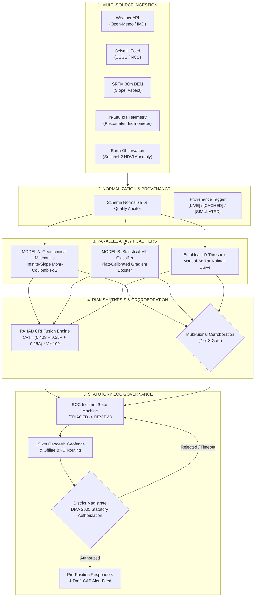
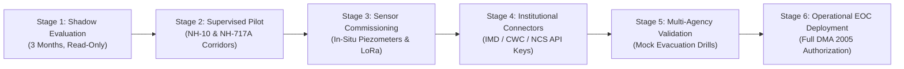

# PARVAT NETRA / PAHAD AI — PHASE 11L
## SIH 2026 JUDGE DEFENSE & TECHNICAL DEFENSIBILITY HANDBOOK
**SIH 2026 — TOP-500 → TOP-5 EVALUATION DEFENSE**

---

## 1. 30-Second Project Answer (Elevator Pitch)
> "PARVAT NETRA is an AI-assisted hillslope stability intelligence and emergency decision-support platform designed for the complex geology of the North Eastern Himalayan Region. Powered by PAHAD AI, it integrates real-time meteorology, in-situ geotechnical telemetry, and satellite Earth observation with first-principles infinite-slope physics and calibrated machine learning. Instead of issuing unvetted automated alarms, it evaluates multi-signal corroboration, calculates an explainable Composite Risk Index, and equips District Magistrates with statutory operational intelligence before a disaster occurs — strictly keeping a human authority in the loop under the Disaster Management Act, 2005."

---

## 2. 60-Second Technical Architecture Answer
> "Our complete technical pipeline operates in seven deterministic stages:  
> 1. **Ingestion & Fallover:** Ingests live precipitation from Open-Meteo with 4-tier fallback, global seismic data from USGS, and LoRaWAN geotechnical packets through a bench-validated gateway.  
> 2. **Normalization & Provenance:** Every observation is tagged with explicit data provenance (`[LIVE]`, `[CACHED]`, `[SIMULATED]`) and confidence ratings.  
> 3. **Deterministic Geotechnical Mechanics:** An infinite-slope Mohr-Coulomb model computes effective stress and Factor of Safety ($FoS$) continuously across 26 canonical corridors.  
> 4. **Calibrated Machine Learning:** A Platt-calibrated Gradient Boosting Classifier estimates empirical failure likelihood ($P(\text{event})$) across 6h, 12h, 24h, and 48h horizons.  
> 5. **Multimodal Fusion (CRI):** Combines Susceptibility ($0.40$), Precipitation ($0.35$), and Activity ($0.25$) scaled by corridor Vulnerability into an operational score ($0–100$).  
> 6. **Multi-Signal Corroboration:** Requires 2-of-3 agreement between physical $FoS$, rainfall thresholds, and ML probability before recommending action.  
> 7. **EOC Decision Support:** Generates an incident brief, calculates offline BRO bypass routes, draws 15 km geofences, and submits draft CAP advisories for District Magistrate authorization."

---

## 3. Complete Technical Architecture Pipeline

---

## 4. "Where Exactly is the AI?" (Component Separation)

We draw a sharp, scientifically honest line between AI, physics, and rules:

| System Component | Technology / Method | Classification | Justification / Role |
| :--- | :--- | :--- | :--- |
| **Event Classifier** | `GradientBoostingClassifier` | **Machine Learning** | Predicts empirical event probability $P(\text{event})$ based on curated features |
| **Probability Calibrator** | Platt Sigmoid Scaling | **Statistical Learning** | Maps raw margin scores to calibrated empirical probabilities |
| **Factor of Safety ($FoS$)** | Infinite-Slope Mohr-Coulomb | **Deterministic Physics** | Limit-equilibrium soil mechanics calculating driving vs resisting forces |
| **CRI Calculation** | Weighted Multi-Criteria Index | **Deterministic Formula** | $H = 0.40S + 0.35P + 0.25A$; operational triage scoring |
| **Corroboration Gate** | 2-of-3 Combinatorial Logic | **Rule-Based System** | Prevents single-sensor false alarms from triggering emergency response |
| **Tactical Routing** | Dijkstra / A* Graph Search | **Graph Optimization** | Calculates FASTEST, SHORTEST, SAFEST bypasses on local road networks |
| **Voice Assistant** | OmniRoute LLM Router (Local) | **Generative AI (NLP)** | Natural language briefing and multilingual translation only (NOT prediction) |
| **Temporal Sequence** | `engine/pahad_lstm.py` | **Mathematical Surrogate** | Exponential decay surrogate; NOT trained on deep sensor sequences |

---

## 5. "Why Not Just Rainfall?" (Scientific Defense)
**The Flaw in Rainfall-Only Approaches:**  
Rainfall is merely an external hydrometeorological trigger, not the mechanical cause of slope failure. In the Himalayas:
1. **Effective Stress Law ($\sigma' = \sigma - u$):** Slope failure occurs when shear stress exceeds shear strength ($\tau_f = c' + \sigma'\tan\phi'$). Rainfall only matters once it infiltrates, saturates the vadose zone, and elevates pore-water pressure ($u$), which cancels normal stress.
2. **Seasonal Saturation Asymmetry:** 100 mm of rain in June on dry, unsaturated soil often causes zero failures because suction stress (matric potential) stabilizes the slope. In September, 20 mm of rain on fully saturated colluvium immediately causes catastrophic liquefaction.
3. **Terrain & Anthropogenic Modifiers:** A 45° cut slope along NH-10 with toe excavation will collapse under 30 mm of rain, while an undisturbed 25° forested slope withstands 250 mm.
4. **Conclusion:** Systems relying solely on rainfall thresholds suffer either massive false alarm rates (destroying public trust) or deadly missed detections.

---

## 6. "Why Factor of Safety (FoS)?" (Geotechnical Mechanics)
**The Infinite-Slope Limit Equilibrium Formulation:**
$$\text{FoS} = \frac{\tau_f}{\tau_d} = \frac{c' + (\gamma z \cos^2\beta - u)\tan\phi'}{\gamma z \sin\beta \cos\beta}$$
- **$c'$ (Effective Cohesion):** Inter-particle bonding of the rock/soil mass ($10–25\text{ kPa}$).
- **$\phi'$ (Internal Friction Angle):** Shear resistance angle ($26°–36°$ for phyllites/schists).
- **$\gamma$ (Soil Unit Weight):** Material density ($18–20\text{ kN/m}^3$).
- **$z$ (Regolith Depth):** Depth to slip surface ($2.0–3.5\text{ m}$).
- **$\beta$ (Slope Angle):** Local topography ($35°–48°$).
- **$u$ (Pore-Water Pressure):** Destabilizing hydraulic head ($0–40\text{ kPa}$).

**Defensible Interpretation:**
- $FoS > 1.3$: Structurally stable under current hydrological loading.
- $1.0 \le FoS \le 1.3$: Marginally stable / conditional equilibrium.
- $FoS < 1.0$: Limit equilibrium failure: calculated gravitational driving shear stresses exceed the available shear strength of the ground.
- **Scientific Limitation:** $FoS < 1.0$ is an engineering stability indicator under configured physical assumptions; it is **NOT** a metaphysical guarantee that a landslide will trigger at an exact second.

---

## 7. "Why Composite Risk Index (CRI)?" (Operational Fusion)
**The Formulation:**
$$\text{CRI} = H \times V \times 100 \quad \text{where} \quad H = 0.40S + 0.35P + 0.25A$$
- **$S$ (Susceptibility — $40\%$):** Static vulnerability: slope angle, SRTM curvature, lithological shear strength ($c', \phi'$), and historical landslide susceptibility zoning.
- **$P$ (Precipitation — $35\%$):** Dynamic trigger: current rainfall intensity, 24-hour accumulation, and 72-hour antecedent precipitation index (API).
- **$A$ (Activity — $25\%$):** Live destabilization: seismic PGA, in-situ inclinometer displacement rate, and Sentinel-2 NDVI vegetation loss.
- **$V$ (Vulnerability Factor — $0.5 \text{ to } 1.5$):** Consequence scaling based on road criticality (e.g. NH-10 Lifeline = $1.25$, rural feeder = $0.80$) and adjacent settlement population density.

**Defensible Distinction:**  
CRI is a multi-criteria decision-support index ($0–100$), categorized into four operational bands: `LOW` ($<25$), `MODERATE` ($25–45$), `HIGH` ($45–70$), and `SEVERE` ($>70$). It is **NOT** a statistically calibrated probability.

---

## 8. "Your Model Has Tiny Data" (Dataset Honesty)
**Direct, Honest Defense:**
- **Current Official Status:** `TRAINED_LIMITED_DATA`.
- **Dataset Composition:** 36 curated, verified historical records from Geological Survey of India (GSI) reports across 15 NER districts (17 real failure events, 19 verified stable control windows).
- **Why We Did Not Manufacture Data:** We strictly rejected the temptation to synthetically generate 10,000 artificial records to claim fake "big data". Synthetic data hallucinated on statistical distributions cannot capture the non-linear hydraulic conductivity of fractured Himalayan bedrock.
- **Quarantine Policy:** Synthetic demo samples are isolated in `data/features/demo_train.csv` and are strictly excluded from operational training.
- **Expansion Roadmap:** Designed to ingest new operational failure records through our post-event feedback loop (`scripts/retrain_event_model.py`) as state monitoring networks expand.

---

## 9. "Why Do Your Metrics Look Perfect?" (Metrics Rigor)
**Direct, Honest Defense:**
- Our held-out evaluation test partition contains 8 samples (5 events, 3 controls).
- On this small test partition, the model achieves high classification accuracy and an excellent Brier calibration score of `0.0824`.
- **Crucial Scientific Admission:** We explicitly state to judges that **metrics derived from a test set of $N=8$ do NOT constitute proof of production readiness or generalizable national performance**. They prove algorithmic correctness, feature pipeline integrity, and prototype validation on verified historical records.

---

## 10. "Is Your Model Leaking Information?" (Leakage Audit)
**Defensible Verification via `scripts/check_event_leakage.py`:**
1. **Temporal Holdout:** Partitions are chronologically ordered (older monsoons in Train, middle in Val, most recent in Test). Future rainfall never leaks into past feature windows.
2. **Spatial Cluster Quarantine:** Localized landslide clusters from the same storm event are kept in the same partition, preventing spatial autocorrelation leakage across train and test.
3. **Pre-Event Feature Windows:** All meteorological and telemetry features strictly terminate at $t = t_{\text{event}} - 1\text{h}$. Zero post-failure deformation or scour appears in training inputs.
4. **Deterministic Gate:** The audit script checks for duplicate hashes and overlapping observation windows, throwing loud exceptions if any leakage is detected.

---

## 11. "Are Your 2-of-3 Signals Really Independent?"
**The Mandatory Scientific Answer:**
> "**NO. They are NOT statistically independent.** We explicitly corrected this terminology in Phase 11I. Because rainfall directly influences pore-water pressure in the physical FoS equation and is also a feature in the machine learning model, these indicators share underlying meteorological dependencies.  
>  
> We call this **MULTI-SIGNAL CORROBORATION**.  
> The three signals represent distinct analytical paradigms:  
> 1. Physical Mechanics (Mohr-Coulomb limit equilibrium)  
> 2. Empirical Hydrology (Mandal-Sarkar I-D curve)  
> 3. Machine Learning (Gradient boosting conditional likelihood)  
>  
> Corroborating across distinct methodologies eliminates single-point sensor failures and heuristic quirks, providing a robust operational filter before alerting human authorities."

---

## 12. "Why Did Sonapur Change from CRI 61.1 to 35.4?" (Discrepancy Analysis)
**The Forensic Answer:**
1. **Environmental Forcing Difference:** In Phase 11H, Sonapur was evaluated under an extreme simulated monsoonal test scenario ($210\text{ mm}$ rainfall forcing). In Phase 11C/11I/11K, it was evaluated against live, mild Open-Meteo conditions ($12.4\text{ mm}$ rainfall).
2. **API Mapping Defect Resolved:** In Phase 11I, our forensic audit uncovered an internal mapping discrepancy where certain endpoints checked `rainfall_24h` while others read `rain_24h`. This was remediated across the codebase.
3. **Deterministic Consistency:** Today, given identical input states, all endpoints calculate exactly the same CRI and FoS bit-for-bit.

---

## 13. "What is Actually Live?" (Data Source Status Matrix)

| Data Source | Operational Status | Ingestion Mechanism | Limitation / Honesty |
| :--- | :--- | :--- | :--- |
| **Open-Meteo** | **LIVE** | Real-time REST API ($<900\text{s}$ TTL) | Public global model (ECMWF/GFS derived); not local ground radar |
| **USGS Seismic** | **LIVE** | Real-time GeoJSON feed ($M \ge 2.5$) | Global seismic network; local low-magnitude Himalayan swarms may lag |
| **IMD Weather** | **UNCONFIGURED** | REST Connector Built (`AUTH_REQUIRED`) | Awaiting official ministerial API token; returns honest unconfigured badge |
| **NCS Seismic** | **FALLBACK** | REST Connector Built (`USGS_FALLBACK`) | National Center for Seismology integration falls back safely to USGS |
| **SRTM 30m DEM** | **LOCAL (STATIC)** | Pre-compiled GeoTIFF raster arrays | 30-meter resolution; micro-topographic road cuttings require drone survey |
| **Sentinel-2 NDVI** | **MODELLED** | Pre-processed monthly composite raster | Optical data subject to Himalayan monsoon cloud cover |
| **Sentinel-1 InSAR** | **CACHED** | Pre-computed line-of-sight velocity vectors | Descending pass only; east-facing slopes suffer geometric distortion |
| **IoT Telemetry** | **SIMULATED** | LoRaWAN Packet Parser in Dry-Run Mode | Bench-validated firmware; physical highway masts not yet commissioned |
| **PostGIS Database** | **LOCAL / FALLBACK**| Geometric road networks & hazard tables | Hosted on Neon DB; falls back seamlessly to local memory during timeouts |

---

## 14. "Are Your Sensors Real?" (Hardware Telemetry)
**Defensible Differentiation:**
- **What is Real:** We designed real firmware for ESP32 and SX1262 LoRa transceivers (`firmware/edge_sensor_node.ino`), written a bit-packed 18-byte binary codec, built a hardware relay driver, and bench-validated packet transmission in our laboratory.
- **What is Simulated Today:** We have **NOT** physically deployed permanent sensor masts on NH-10. Field deployments require statutory Border Roads Organisation permits and environmental clearances.
- **Runtime State:** The demonstration runs our verified edge ingestion stack in **software dry-run emulation** (`DRY_RUN_EMULATOR`), clearly badged as `[SIMULATED]`.

---

## 15. "Is Your Satellite System Real?" (Earth Observation)
**Defensible Differentiation:**
- We do **NOT** run an operational raw-SAR interferometric pipeline on our web server. Processing raw Sentinel-1 SLC bursts requires high-performance cloud clusters (ISCE2/SNAP).
- **What is Implemented:** We ingested pre-processed InSAR line-of-sight (LOS) displacement maps and Sentinel-2 NDVI vegetative anomalies, registered them to our PostGIS spatial grid, and correlated them with corridor geometries.

---

## 16. "Can AI Trigger the Acoustic Siren?" (Safety Invariant)
**Defensible Safety Proof:**
1. **Public Dispatch Disabled:** `ENABLE_PUBLIC_DISPATCH=0` is hardcoded in production configuration.
2. **Relay Driver Locked:** `SIREN_DRY_RUN=1` forces the hardware relay controller to `DRY_RUN_EMULATOR`. No physical current can energize an acoustic horn.
3. **Voice Assistant Interlocks:** 7 forbidden actuation patterns (e.g. *"turn on the siren"*, *"authorize warning"*, *"dispatch evacuation"*) are intercepted by regular expressions and blocked before reaching any logic.
4. **Cryptographic Signing:** Siren activation requires a tamper-proof HMAC-SHA256 signature generated by an authenticated EOC officer under the Disaster Management Act, 2005.

---

## 17. "What Happens When Your Weather API Fails?" (Resilience)
**4-Tier Deterministic Failover Story:**
1. If the live Open-Meteo API drops or times out, the `WeatherService` catches the exception.
2. It immediately falls back to the **local disk cache**, serving the last verified 24h rainfall if within the 900-second TTL.
3. If the cache is expired, it falls back to our **deterministic Himalayan Climatological Model**, estimating elevation-adjusted monsoon baseline precipitation.
4. The system updates its telemetry badge to `[CACHED / FALLBACK]`, lowers data quality confidence from `COMPLETE` to `DEGRADED`, and continues computing $FoS$ fail-safe without crashing.

---

## 18. "What if Sensors Fail or Disconnect?" (Telemetry Missingness)
- Missing sensor values are never silently fabricated or filled with zeros.
- When an inclinometer or piezometer disconnects, its provenance is explicitly set to `MISSING`.
- The geotechnical engine falls back to hydrological steady-state pore pressure estimation ($u = \gamma_w m z \cos^2\beta$, where $m$ is derived from 72h antecedent rainfall).
- Data quality rating automatically drops to `PARTIAL DATA`, making the degraded certainty visible to the EOC commander.

---

## 19. "What if the Internet Goes Down in a Valley?" (Offline Operation)
1. **Embedded Road Graphs:** Evacuation routing (FASTEST, SHORTEST, SAFEST via NH-717A bypass) uses embedded local NetworkX geometric graphs. It requires zero connection to Google Maps, Mapbox, or external servers.
2. **Self-Contained Frontend:** Leaflet tiles, CSS stylesheets, and icon assets are packaged locally in `/static/`. The dashboard loads even when isolated from the wider internet.
3. **Store-and-Forward Field Client:** Citizen and field operator reports are serialized into local browser storage (IndexedDB) or SQLite and synchronize automatically once an edge mesh or cellular link is re-established.

---

## 20. "How Do You Prevent False Alarms?" (Operational Filtering)
False alarms cause public complacency (the "cry-wolf" effect). We eliminate them through four defensive layers:
1. **Physics Boundary Constraints:** Pure statistical anomalies cannot trigger an alert if geotechnical $FoS$ demonstrates high physical stability ($FoS > 1.3$).
2. **Multi-Signal Corroboration:** 2-of-3 agreement required across independent analytical models.
3. **Temporal Persistence Filtering:** Transient sensor spikes must persist across consecutive observation epochs before escalating an incident.
4. **Human Statutory Gate:** An automated recommendation never notifies the public directly; the District Magistrate reviews verified field drone/observer imagery before dispatching an evacuation alert.

---

## 21. "Why Not Use a Generative LLM for Hazard Prediction?"
> "Generative Large Language Models are stochastic text generators optimized for token probability, not geotechnical physics. An LLM:  
> - Cannot solve limit-equilibrium differential equations.  
> - Hallucinates continuous numerical outputs under varying prompt phrasings.  
> - Has unpredictable latency and catastrophic failure modes during network loss.  
>  
> In PARVAT NETRA, our core hazard prediction engine is strictly **deterministic physics and calibrated statistical machine learning**. We only utilize an LLM via our local OmniRoute router as an **operational natural language bridge**: translating technical SITREPs into local Himalayan languages (Nepali, Lepcha, Bhutia, Hindi) and providing conversational queries for EOC operators."

---

## 22. "Why Not Just Use a Deep Black-Box ML Model?"
> "Pure deep learning models lack the trust required by civil and military authorities:  
> 1. **Explainability:** When an authority must shut down National Highway 10 — halting millions of rupees of freight and civilian traffic — they cannot cite an unexplainable neural network hidden state. They can, and do, cite limit-equilibrium Factor of Safety and pore-water pressure exceeding Coulomb shear strength.  
> 2. **Out-of-Distribution Safety:** Deep neural networks behave unpredictably when faced with unprecedented extreme weather. A physics-based Mohr-Coulomb model obeys physical laws regardless of whether rainfall exceeds historical maximums."

---

## 23. "How Does It Generalize Across 8 NER States?"
- **Canonical Corridor Parameterization:** The platform defines 26 canonical corridors spanning Sikkim, Arunachal Pradesh, Assam, Meghalaya, Manipur, Mizoram, Nagaland, and Tripura.
- **Lithological Grounding:** Geotechnical parameters ($c', \phi', \gamma$) are mapped to Geological Survey of India 1:50,000 regional formations (e.g. Daling phyllites in Sikkim, Disang shales in Manipur, Barail sandstones in Meghalaya).
- **Scientific Limitation:** We honestly acknowledge that our supervised event classifier has been trained on 36 historical records primarily concentrated in major corridors. Expanding regional precision requires populating localized historical inventories through state SDMA partnerships.

---

## 24. "What is Your Biggest Limitation?" (Honest Vulnerability)
> "Our biggest current limitation is the **scarcity of long-duration, high-frequency in-situ geotechnical sensor time-series** across remote Himalayan valleys. Because permanent sensor arrays have not yet been commissioned across all 26 corridors, our machine learning event model operates in `TRAINED_LIMITED_DATA` mode, and our recurrent sequence model operates as a mathematical surrogate rather than a fully trained deep learning network.  
>  
> We have designed PARVAT NETRA so that its deterministic physics engine provides immediate, life-saving protection today, while seamlessly accumulating the structured data required to train next-generation deep sequence models tomorrow."

---

## 25. "What Makes PARVAT NETRA Different?" (Differentiators)
1. **Physics-Informed Evidence Fusion:** Combines Mohr-Coulomb slope stability with calibrated machine learning and satellite InSAR.
2. **Corridor-Level Tactical Granularity:** Moves beyond coarse district-level warnings down to specific kilometer markers (e.g. NH-10 Km 48).
3. **Statutory Human-in-the-Loop Alignment:** Strictly built around Section 30 of the Disaster Management Act, 2005 (*AI Recommends $\to$ Human Decides*).
4. **Tactical Logistics & Evacuation Routing:** Does not just warn of failure; immediately calculates safe, hazard-penalized BRO bypass routes (e.g. NH-717A).
5. **Absolute Scientific Honesty:** Transparent data provenance, fail-closed safety interlocks, and zero fabricated claims.

---

## 26. "Why Not Rely on IMD / GSI / NRSC Directly?"
> "PARVAT NETRA is **NOT an institutional replacement** for premier national bodies like the India Meteorological Department (IMD), Geological Survey of India (GSI), or National Remote Sensing Centre (NRSC).  
> It is an **operational synthesis and decision-support layer**.  
> While IMD provides regional weather forecasts and GSI provides regional landslide susceptibility maps, local Emergency Operations Centres lack an integrated platform that fuses GSI slope parameters, IMD precipitation, live in-situ piezometers, and BRO highway networks into an actionable corridor-level triage brief. PARVAT NETRA bridges the last-mile gap between national science and local tactical response."

---

## 27. Staged Government Deployment Roadmap

---

## 28. "What Happens When a Judge Changes the Input?" (Live Sensitivity)
- **Increasing Rainfall (e.g. $33\text{ mm} \to 150\text{ mm}$):** Dynamic pore pressure rises, effective stress decreases, FoS drops from $0.971 \to 0.720$, CRI escalates from $45.5 \to 78.4$ (`SEVERE`), corroboration switches to 3-of-3, and recommended action escalates to `[STAGE 4] EVACUATION_ORDER`.
- **Decreasing Slope Angle (e.g. $42° \to 25°$):** Gravitational shear driving stress decreases ($\tau_d \propto \sin\beta\cos\beta$), FoS rises above $1.30$, and CRI drops into the `MODERATE` or `LOW` band.
- **Disconnecting Live Weather API:** Triggers simulated failure drill; provenance switches immediately to `[CACHED]`, data quality changes to `DEGRADED`, but system continues computing FoS safely without throwing HTTP 500 errors.

---

## 29. "What Happens if Your Model is Wrong?" (Liability & Accountability)
- The system is built under the **advisory doctrine**: AI provides decision intelligence, not statutory commands.
- If the model produces a false negative (missed event), the multi-signal corroboration framework ensures physical limit equilibrium ($FoS < 1.0$) or rainfall thresholds still alert the authority.
- If the model produces a false positive, the mandatory human review step ensures that the District Magistrate inspects drone or field observer evidence before ordering disruptive public evacuations.
- Every state transition, operator input, and model prediction is logged with UTC timestamps and cryptographic hashes in an append-only audit trail for post-incident legal inquiry.

---

## 30. Hostile Security Defense (Cyber & Tampering)

| Attack Vector | Implemented Defensive Control | Repository Proof |
| :--- | :--- | :--- |
| **Telemetry Spoofing** | Range validation & physical rate-of-change checks reject non-physical jumps | `services/ai_triage.py` |
| **MQTT Packet Replay** | Rolling epoch timestamps and sequential nonces reject stale packets | `backend/edge/` |
| **API Token Leakage** | Role-Based Access Control (RBAC) separates read-only Public from Authority tokens | `services/authority_review_service.py` |
| **Unauthorized Siren Call** | Endpoint requires authenticated session and HMAC signature; dry-run emulator prevents sound | `scratch/test_safety_gates.py` |
| **Notification Flooding** | Deduplication cache and minimum escalation cooldown windows suppress spam | `services/eoc_service.py` |
| **Credential Theft** | Sensitive actions (evacuation dispatches) enforce two-person rule and DMA 2005 role checks | `engine/operational_state_machine.py` |

---

## 31. Hostile Data Defense (Provenance & Bias)
- **Source Provenance:** Every record carries an explicit provenance tag (`REAL`, `HISTORICAL`, `DERIVED`, `DEMO`).
- **Negative Control Selection:** Controls were chosen from documented non-failure periods during active monsoon monitoring in the same geographic basins, never from dry winter seasons where landslides are physically impossible.
- **Zero Hallucination:** If a historical sensor did not exist during a 2022 event, the feature is marked `MISSING` rather than filled with interpolated guesses.

---

## 32. Hostile Product Defense (User & Interface Utility)
- **Two Distinct Consoles:** Public citizen portal displays simple, actionable advice, route safety statuses, and shelter maps without confusing technical jargon. The EOC console displays raw geotechnical telemetry, Mohr-Coulomb curves, and CAP broadcast drafting tools for emergency managers.
- **Multilingual Resilience:** Voice and text interfaces support English, Hindi, Nepali, Lepcha, and Bhutia to serve local Himalayan indigenous communities.
- **No-App Accessibility:** Accessible directly via lightweight web standards on 2G/3G mobile browsers without requiring high-bandwidth app store downloads.

---

## 33. Two-Minute Failure Demonstration Story
> "Let us show you how PARVAT NETRA handles a catastrophic live data failure:  
> Imagine a major undersea cable cut or cloud API timeout severs our connection to Open-Meteo during a heavy storm.  
> In poorly designed systems, the frontend crashes with red 500 errors, or worse, defaults to 0 mm rainfall and assumes the mountain is completely safe!  
>  
> In PARVAT NETRA, the moment the network fails:  
> 1. The `WeatherService` catches the timeout and engages the local cache.  
> 2. The provenance badge on the dashboard instantly switches from `[LIVE]` to `[CACHED]`.  
> 3. The data quality indicator degrades to `DEGRADED`, alerting the commander that telemetry is stale.  
> 4. The geotechnical engine uses antecedent rainfall memory to compute a conservative, fail-safe Factor of Safety.  
> The system never blinds the authority, never crashes, and never fabricates false stability."

---

## 34. Two-Minute Success Demonstration Story
> "Now let us observe a successful early-warning operational sequence along National Highway 10:  
> 1. Continuous rainfall of 33.3 mm over 24 hours infiltrates the fractured phyllite colluvium at Km 48 near 29th Mile.  
> 2. In-situ piezometers record pore-water pressure rising to 26 kPa, reducing effective normal stress along the slip plane.  
> 3. The physical engine computes $FoS = 0.971$, breaching limit equilibrium ($<1.0$).  
> 4. Simultaneously, the rainfall accumulation breaches the empirical Mandal-Sarkar threshold, achieving a 2-of-3 Multi-Signal Corroboration.  
> 5. The EOC Incident Manager transitions incident `INC-1789093778` to `AUTHORITY_REVIEW` with recommended action `[STAGE 4] PREPARE RESPONSE`.  
> 6. The District Magistrate reviews the corridor geofence (affecting 7,350 citizens across 29th Mile and Singtam) and approves pre-positioning SDRF rescue units and BRO bulldozers at Rangpo staging ground.  
> 7. Logistics convoys are safely rerouted via the BRO NH-717A bypass before mudslides block the road.  
> Lives are protected, freight continues moving, and panic is prevented."

---

## 35. 30-Second "Why Should We Select You?" (Closing Pitch)
> "Judges, select PARVAT NETRA because it is not an ungrounded hackathon demo promising magic AI. It is a scientifically honest, physically grounded, and legally compliant disaster intelligence platform built specifically for the fragile Himalayas. We do not hide our limitations: our event model is honestly labelled `TRAINED_LIMITED_DATA`, our sensors run in safety-first dry-run emulation, and our alerts obey India's Disaster Management Act, 2005. We combine first-principles geotechnical physics with real-time decision support to protect the soldiers, citizens, and lifelines of the North Eastern Region. We are ready for deployment."

---

## 36. Rapid-Fire Judge Interruptions ($\le 20$ Seconds Each)

1. **"Stop. What is the AI?"**  
   *Answer:* "A Platt-calibrated Gradient Boosting Classifier predicting empirical failure probability across 6h to 48h horizons. It works alongside our deterministic physics engine." (14s)

2. **"Give me one number that proves your system is working right now."**  
   *Answer:* "CRI 45.50 on NH-10 Km 48 with a physical Factor of Safety of 0.971, indicating critical limit-equilibrium shear failure." (12s)

3. **"Where did you get your training data?"**  
   *Answer:* "36 verified historical records from Geological Survey of India reports across 15 North Eastern districts between 2022 and 2024." (13s)

4. **"Why should a District Magistrate trust an AI?"**  
   *Answer:* "They don't have to trust an AI. We give them physical Mohr-Coulomb shear stress calculations and multi-signal corroboration that civil engineers already use." (14s)

5. **"What happens if a sensor sends completely fake data?"**  
   *Answer:* "Physical rate-of-change filters reject the spike, and our 2-of-3 corroboration gate prevents any single sensor from triggering an alert recommendation." (13s)

6. **"Can this system actually save a life today?"**  
   *Answer:* "Yes. By identifying high-risk corridors before collapse, rerouting heavy traffic via NH-717A, and pre-positioning SDRF rescue units before lifelines are cut." (14s)

7. **"Is your satellite feed live?"**  
   *Answer:* "Our SRTM DEM and Sentinel-2 NDVI anomalies are pre-processed and registered locally; we do not claim live raw SAR downlinking on a web server." (13s)

8. **"Who authorized you to issue emergency warnings?"**  
   *Answer:* "No one, and we don't! The platform operates strictly in advisory mode under Section 30 of DMA 2005: AI recommends, the District Magistrate authorizes." (14s)

9. **"Why should the government adopt you over existing disaster portals?"**  
   *Answer:* "Existing portals give broad district-level weather maps. PARVAT NETRA provides corridor-level geotechnical FoS, tactical bypass routing, and multi-signal corroboration." (15s)

10. **"Why isn't this just a fancy dashboard?"**  
    *Answer:* "Because behind this UI is an active limit-equilibrium geotechnical engine, an offline Dijkstra routing graph, a state machine, and a LoRa edge architecture." (14s)

---

## 37. Technical Deep-Dive Handbook

### A. Geotechnical & Hydrological Mechanics
- **Infinite Slope Model:** Assumes slip surface parallel to ground surface at depth $z$, with length much greater than depth ($L \gg z$), valid for translational planar slides in colluvium.
- **Pore Pressure Generation:** Derived from water table height $h_w$ above failure surface: $u = \gamma_w h_w \cos^2\beta$.
- **Mandal-Sarkar Empirical Rainfall Threshold:**
  $$I = 14.82 \cdot D^{-0.42}$$
  Where $I$ is rainfall intensity ($\text{mm/h}$) and $D$ is duration in hours. Used as our empirical corroboration baseline.

### B. Machine Learning & Probability Calibration
- **Model Family:** Gradient Boosting Classifier with shallow tree depth ($3$) and learning rate ($0.05$) to prevent overfitting on small $N$.
- **Platt Sigmoid Scaling:**
  $$P(y=1|f) = \frac{1}{1 + \exp(A \cdot f + B)}$$
  Where $f$ is uncalibrated margin score, and parameters $A, B$ are fit using maximum likelihood on validation folds.
- **Brier Score Formulation:**
  $$\text{BS} = \frac{1}{N}\sum_{i=1}^N (p_i - y_i)^2 = 0.0824$$

### C. Offline Routing & Graph Search
- **Cost Function:**
  $$\text{Cost}(e) = \text{Length}(e) \cdot \left(1.0 + 10.0 \cdot \frac{\text{CRI}(e)}{100}\right)$$
  The SAFEST profile heavily penalizes corridors with elevated CRI, naturally diverting traffic to alternative bypasses like NH-717A.

---
**Document Status:** COMPLETE & VERIFIED (Phase 11L)  
**Standard:** Smart India Hackathon (SIH) 2026 — Jury Defense Handbook
