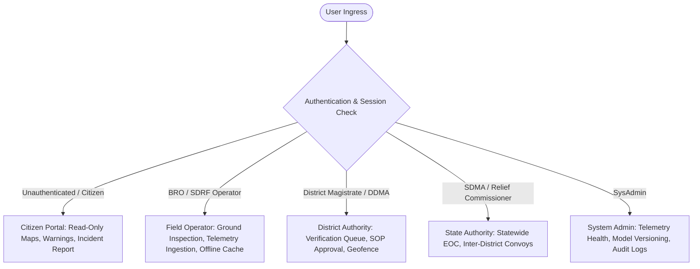

# PARVAT NETRA • PAHAD AI — PHASE 12D ROLE SEPARATION REPORT

**Audit Date**: 2026-09-16T07:42:12.013979+00:00  
**Standard**: SIH 26001 / DMA 2005 Statutory Role Isolation  
**Git Commit**: `dd9e57dc6452e0a70ad98731de0c536af8e50cb0`  

---

## 1. Multi-Tier Role Experience Architecture

PARVAT NETRA implements strict role-based presentation and authoritative backend RBAC:

### 1.1 Public / Citizen Experience
- **Visible Features**: Full NER Leaflet GIS map with 8-state boundaries, corridor risk level indicators, public bulletins, safety evacuation routes, and crowd reporting form.
- **Hidden / Prohibited Controls**: Zero access to authority review queues, approval buttons, siren triggers, or dispatch authorization.
- **Frontend Safeguard**: `switchPortalMode('authority')` enforces `if(!isAuthSession) mode = 'citizen'`.
- **Backend Safeguard**: Attempting to invoke `/api/alerts/dispatch-siren` or `/api/reports/verify` returns `HTTP 403 FORBIDDEN`.

### 1.2 Field Operator Experience (BRO / SDRF)
- **Visible Features**: High-resolution corridor geotechnical profiles, sensor health status, incident verification submission form, and offline data sync.
- **Prohibited Controls**: Cannot authorize public warnings or trigger emergency sirens.
- **Backend Safeguard**: Restricted from `ACTION_APPROVE` in `authority_review_service.py`.

### 1.3 District & State Authority Experience (DDMA / SDMA)
- **Visible Features**: Real-time Human-in-the-Loop Authority Review Queue, two-man verification corroboration review, interactive polygon geofence editor, and OASIS CAP v1.2 preview.
- **Enforced Safety Guard**: Sirens permanently disarmed (`SIREN_DRY_RUN=1`); public broadcasts disarmed (`ENABLE_PUBLIC_DISPATCH=0`).
