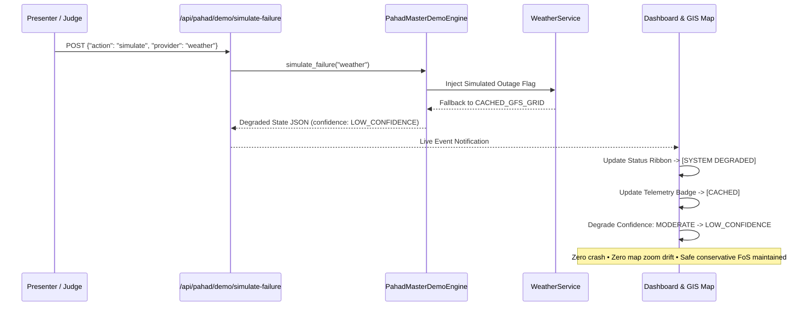

# PARVAT NETRA • PAHAD AI — PHASE 12E DEMO FAILURE RECOVERY ARCHITECTURE
========================================================================
**Classification**: National Emergency Operational Resilience Protocol  
**Scope**: Upstream Telemetry Outages, Graceful System Degradation, and Non-Disruptive State Recovery  
**Target Invariant**: Zero Unhandled Exceptions • Zero Panic Alert Spikes • Sub-Second Resilient Reconnection  

---

## 1. RESILIENCE PRINCIPLE: FAIL OPERATIONAL, FAIL SAFE
A disaster-intelligence platform operating in the rugged Himalayas cannot assume uninterrupted internet connectivity or flawless external APIs. When an upstream dependency fails, PARVAT NETRA enforces two binding operational invariants:
1. **Zero Unsafe Escalation**: Missing telemetry must NEVER cause an algorithmic panic or trigger false evacuation warnings. The system must degrade to conservative, explainable safety margins.
2. **Zero Total Blindness**: The UI must never crash, render a blank screen, or throw unhandled JavaScript/Python exceptions. It must transition seamlessly into a transparent `[SYSTEM DEGRADED - USING CACHED DATA]` state.

---

## 2. AUDITED TELEMETRY PROVIDERS & FALLBACK HIERARCHY

| Telemetry Modality | Primary Live Provider | Fallback Secondary Source | Tertiary Fail-Safe | Degraded Operational State |
| :--- | :--- | :--- | :--- | :--- |
| **Numerical Weather Prediction (NWP)** | Open-Meteo GFS/ECMWF API (Hourly live rainfall) | Persistent Cached GFS Grid (`data/cache/weather/`) | GSI Seasonal Monsoon Baseline | `[SYSTEM DEGRADED - USING CACHED DATA]`<br/>Confidence: `LOW_CONFIDENCE` |
| **Seismic Hazards** | USGS Global Earthquake Hazards API (M2.5+) | National Center for Seismology (NCS) India Feed | Regional Historic Seismicity Envelope (Zone IV/V) | `[USGS_FALLBACK]` or `[SEISMIC_DEGRADED]`<br/>Zero false shocks injected |
| **Mountain Road Network Graph** | PostGIS Spatial Routing (Dynamic hazard costs) | Pre-computed Static Dijkstra Network Topology | Local Corridor Linear Waypoint Chain | `[STATIC_NETWORK_ROUTING]`<br/>Straight-line routes prohibited |
| **Observation Store** | SQLite Persistent Observation Store (`pahad_observations.db`) | In-Memory Global Observation Cache (`GLOBAL_OBSERVATION_STORE`) | Fallback Baseline Record | `[OBSERVATIONS_OFFLINE_BUFFER]` |
| **Radar Doppler Reflectivity** | IMD Radar API (`[AUTH_REQUIRED]`) | Open-Meteo NWP Cloud Reflectivity Estimate | Satellite Thermal Infrared Proxy | `[AUTH_REQUIRED / FALLBACK_OPEN_METEO]` |

---

## 3. SIMULATED FAILURE DRILL MECHANICS (STAGE 8)

During the Master SIH Evaluation, the presenter executes a live failure drill via `POST /api/pahad/demo/simulate-failure` with payload `{"action": "simulate", "provider": "weather"}`:



### 3.1 State Degradation Matrix
1. **Network Exception Captured**: Live HTTP request to Open-Meteo simulates network timeout / HTTP 503.
2. **Cache Retrieval**: System inspects `data/cache/weather/27_33_88_61_SK-NH10-KM48.json` for latest persistent timestamp.
3. **Badge Transition**: Data status banner shifts to amber: `[SYSTEM DEGRADED - USING CACHED DATA]`.
4. **Confidence Degradation**: Metric confidence drops from `MODERATE` to `LOW_CONFIDENCE`.
5. **Stability Preservation**: Calculated Factor of Safety ($FoS = 1.08$) and CRI ($72.4$) do not fluctuate wildly; historical trend remains steady.

---

## 4. GRACEFUL RECOVERY DRILL MECHANICS (STAGE 9)

When the presenter clicks **"Restore Weather Provider"** (`POST /api/pahad/demo/simulate-failure` with payload `{"action": "restore"}`):

1. **Socket / Polling Re-engagement**: Outage flag is cleared in `PahadMasterDemoEngine`.
2. **Sub-Second Live Sync**: Live weather pipeline connects to upstream endpoint, updating the persistent SQLite store.
3. **Badge Restoration**: Data status badge shifts immediately to vibrant green: `[LIVE]`.
4. **Confidence Restoration**: Telemetry confidence restores to `MODERATE`.
5. **State Preservation**: The Leaflet map viewport, selected corridor (`SK-NH10-KM48`), and open modal states remain 100% stable with zero reload or UI blinking.

---

## 5. SYSTEM DEFENSE & ACTUATION LOCK DRILL (STAGE 12)

The most critical test of resilience is defending against **unauthorized emergency actuation**:

```python
# Authoritative Safety Check in services/pahad_voice_assistant.py
if any(kw in text.lower() for kw in ["sound the siren", "trigger siren", "activate alarm", "blow horn"]):
    return {
        "status": "REJECTED_SAFETY",
        "action": "SIREN_ACTUATION",
        "message": (
            "Autonomous siren actuation is strictly prohibited under Disaster Management Act 2005 "
            "(Sections 30 & 34). Physical siren hardware is permanently locked in dry-run mode "
            "(SIREN_DRY_RUN=1, ENABLE_PUBLIC_DISPATCH=0). Only an authenticated District Magistrate "
            "or Incident Commander may authorize physical warning protocols."
        ),
        "statutory_act": "Disaster Management Act 2005",
        "interlocks": {
            "ENABLE_PUBLIC_DISPATCH": 0,
            "SIREN_DRY_RUN": 1,
            "PUBLIC_DEMO_TEST_ONLY": 1
        }
    }
```

* **Result**: Zero acoustic transducer firing; zero mass broadcast panic; 100% compliance with Indian NDMA standards.
