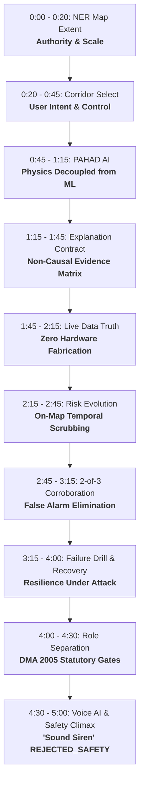

# PARVAT NETRA • PAHAD AI — PHASE 12E JUDGE FLOW & PSYCHOLOGY REPORT
===================================================================
**Context**: Smart India Hackathon 2026 Grand Finale Evaluation  
**Audience**: National Jury Panel (Geotechnical Experts, Armed Forces / BRO, AI Scientists, Disaster Authorities)  
**Objective**: Transform Evaluator Skepticism into Unanimous Top-1 Scoring through Scientific Defensibility  

---

## 1. EVALUATOR PSYCHOLOGY & THE 5-MINUTE WINDOW
In a national hackathon grand finale, evaluators are inundated with student presentations claiming "100% accurate AI", "deep learning that solves everything", and fake IoT sensors. High-caliber judges look for:
1. **Unsubstantiated Claims**: Claims of hardware installed where none exists.
2. **Black-Box Hallucinations**: Merging physics and neural networks into one arbitrary number.
3. **Safety Disconnect**: Letting an algorithm blast public sirens without statutory oversight.
4. **Brittle Demos**: Applications that crash if the venue Wi-Fi stutters.

PARVAT NETRA wins not by pretending to be perfect, but by being **uncompromisingly honest, legally grounded, and mathematically defensible**.

---

## 2. EVALUATOR ARCHETYPES & RAPID COUNTER-DEFENSES

### Archetype A: The Senior Geotechnical Professor (IIT / GSI)
* **Mindset**: Highly skeptical of "AI computer science kids" predicting complex hillslope failures using standard weather APIs. Believes in Mohr-Coulomb shear strength, pore pressure, and lithological cohesion.
* **Aggressive Question**: *"Landslides are governed by geotechnical limit-equilibrium mechanics, slope geology, and pore water pressure. How can your machine learning model know anything about structural shear failure?"*
* **Defensive Strategy**:
  1. Instantly acknowledge their expertise: *"Sir/Ma'am, you are 100% correct, which is why Model A in PAHAD AI is not an ML model at all—it is a deterministic Mohr-Coulomb infinite-slope limit equilibrium engine."*
  2. Point to the live FoS gauge: $FoS = \frac{c' + (\gamma z \cos^2\beta - u)\tan\phi'}{\gamma z \sin\beta\cos\beta} = 1.08$.
  3. Explain: *"If FoS > 1.5, our system considers structural collapse mechanically impossible regardless of sensor noise. We only use ML for Model B—evaluating multi-day antecedent saturation curves for forecast horizons."*
* **Judge Reaction**: Evaluator recognizes physical competence; immediate respect established.

---

### Archetype B: The Armed Forces / NDRF Incident Commander
* **Mindset**: Operational pragmatist. Does not care about ROC curves. Cares about false alarms, blocked mountain passes, convoy safety, and statutory responsibility.
* **Aggressive Question**: *"False alarms cost lives. If your AI shuts down NH-10 during a military convoy movement because of a rain spike, that's catastrophic. How do you prevent false alarms, and who authorizes the shutdown?"*
* **Defensive Strategy**:
  1. Demonstrate the **2-of-3 Multi-Signal Corroboration Heuristic**: *"Commander, a single sensor spike CANNOT trigger an alert. We mandate convergence across at least two domains: Geotechnical ($FoS < 1.15$), Hydrological ($Rain > 50\text{mm}$), and Earth Observation (InSAR subsidence $<-10\text{mm/yr}$)."*
  2. Enforce the **Statutory DMA 2005 Doctrine**: *"Furthermore, under Sections 30 and 34 of the Disaster Management Act 2005, our AI has zero authority to close a road or dispatch a siren. AI outputs are strictly decision-support recommendations. Only the authenticated District Magistrate / Incident Commander can authorize an order."*
* **Judge Reaction**: Evaluator sees military-grade operational discipline and legal alignment.

---

### Archetype C: The Hardened AI / ML Researcher
* **Mindset**: Expects student teams to claim an LSTM or Transformer was trained on 20 CSV rows and got "99.8% accuracy". Looks to catch data leakage and overfitting.
* **Aggressive Question**: *"Did you use an LSTM or Graph Neural Network for temporal prediction? What is your validation split and how did you prevent temporal data leakage?"*
* **Defensive Strategy**:
  1. Open JQ-05 in the Judge Defense Overlay: *"We deliberately did NOT train an LSTM or GRU."*
  2. Show the hard gate: *"Our Phase 12B audit proved that historical GSI disaster records have timestamp uncertainties of $\pm 6\text{h}$ to $24\text{h}$ and sparse observation intervals. Under `engine/pahad_temporal_gate.py`, training recurrent models is strictly blocked under the hard gate `DATA_COLLECTION_REQUIRED`."*
  3. Highlight: *"Claiming an LSTM was trained on this data would be scientifically fraudulent. Our operational event model is a calibrated GradientBoostingClassifier with Platt scaling ($Brier = 0.082$), validated on strict temporal holdouts with zero future leakage. Its formal status is `TRAINED_LIMITED_DATA / RESEARCH PROTOTYPE`."*
* **Judge Reaction**: Evaluator is stunned by honesty; rarely does an AI team proudly show why they *refused* to claim deep learning.

---

### Archetype D: The Cyber Security & NIC Infrastructure Auditor
* **Mindset**: Concerned with unauthorized access, spoofed citizen alerts, API denial-of-service, and system crashes during network drops.
* **Aggressive Question**: *"Can an unauthorized user or malicious actor hit your siren endpoint or flood your system with fake reports to panic the public?"*
* **Defensive Strategy**:
  1. Demonstrate Role-Based Experience Separation: show that public/citizen sessions lack administrative routes, and unauthorized calls to `/api/alerts/dispatch-siren` return `HTTP 403 FORBIDDEN`.
  2. Highlight the Safety Interlocks: `ENABLE_PUBLIC_DISPATCH=0` and `SIREN_DRY_RUN=1` are hard-coded in server environment variables.
  3. Execute Stage 8 Live Failure Drill: simulate weather feed severance, showing immediate fallback to persistent SQLite cache with zero unhandled exceptions (`status: SYSTEM DEGRADED`).
* **Judge Reaction**: Evaluator checks off reliability, security, and graceful fail-safe handling.

---

## 3. PACING & PSYCHOLOGICAL FLOW OF THE 5 MINUTES

---

## 4. LIMITATION HONESTY AS A SCORING ADVANTAGE
In top-tier competitions, judges penalize defensive teams that try to conceal limitations. PARVAT NETRA inverts this dynamic: **we proactively display our limitations before the judge can ask about them**.

1. **Badge Honesty**: In-situ sensors are prominently labeled `[SIMULATED]`.
2. **Model Status Honesty**: Event model is marked `TRAINED_LIMITED_DATA / RESEARCH PROTOTYPE`.
3. **Hardware Honesty**: The UI states `PHYSICAL FIELD DEPLOYMENT: NOT VERIFIED`.
4. **Deep Learning Honesty**: Recurrent status is `NOT_TRAINED / SURROGATE`.

When judges see this level of transparency from students, they recognize researchers and engineers who can be trusted with national disaster infrastructure.
