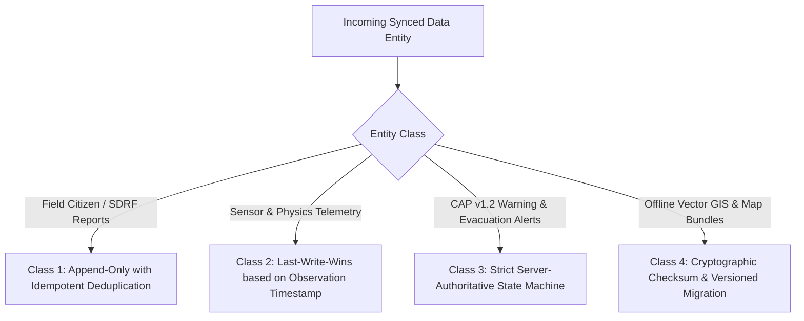
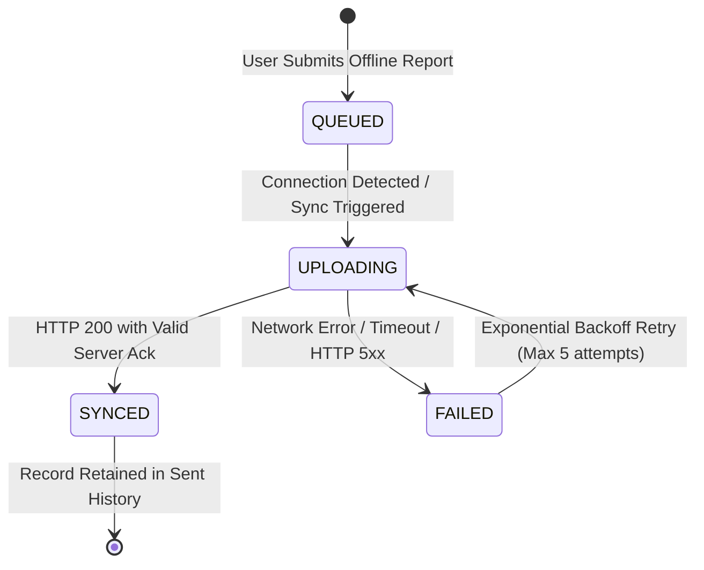

# PARVAT NETRA / PAHAD AI — Phase 5D Synchronization & Conflict Handling Policy

**Document**: `PHASE5D_SYNC_POLICY.md`  
**Phase**: Phase 5D — Offline-First Maps + Resilient Synchronization  
**Authority**: PARVAT NETRA / PAHAD AI Core Engineering Team  
**Standard**: SIH Problem Statement ID 26001 / National Emergency Authority Grade  

---

## 1. Core Synchronization Philosophy

In disaster environments across the Northeast Region (NER), connectivity is intermittent, asymmetric, and prone to sudden prolonged blackouts. Under these conditions, distributed state synchronization must be **deterministic**, **lossless for human field evidence**, and **verifiable without central single points of failure**.

The platform operates under four distinct conflict resolution classes:



---

## 2. Synchronization Rule Taxonomy

### Rule 1: Field Evidence & Citizen Reports (Append-Only)
- **Designation**: `APPEND_ONLY_IMMUTABLE`
- **Conflict Rule**: Client submissions never overwrite or mutate existing server records.
- **Deduplication Key**: Client-generated deterministic identifier:
  `local_id = "PN-OFFLINE-" + timestamp_ms + "-" + random_hex`
- **Behavior**:
  1. When a client submits a batch with a previously synced `local_id`, the server detects the key in the synchronized registry (`_synced_registry`).
  2. The server acknowledges the record as `SYNCED` with `duplicate: true`, returning the existing `server_id` and `tracking_ref` (`PN-REPORT-2026-XXXX`).
  3. No duplicate database row is inserted; no exception is thrown; the client queue successfully marks the item as `SYNCED`.

### Rule 2: Environmental Telemetry & Sector Observations (Last-Write-Wins)
- **Designation**: `LWW_TIMESTAMP_ORDERED`
- **Conflict Rule**: Newer observation wins based on source observation timestamp (`observed_at` or `timestamp`).
- **Behavior**:
  1. When reconciling observation streams (e.g. piezometer pore pressure, rain gauge readings, tiltmeter degrees), the record with the most recent UTC ISO-8601 timestamp supersedes older cached readings for that `(sector_id, feature)` tuple.
  2. If an edge gateway reconnects and pushes historical readings, they are inserted into the time-series store (`ObservationStore`) preserving their historical timestamps without overwriting newer real-time telemetry.

### Rule 3: Public Emergency Alerts & CAP v1.2 Warnings (Server-Authoritative)
- **Designation**: `SERVER_AUTHORITATIVE_STRICT`
- **Conflict Rule**: The central emergency command server is the sole source of truth for alert issuance, escalation, and cancellation.
- **Behavior**:
  1. A client or offline device can NEVER create, dismiss, or cancel an official alert locally.
  2. Alerts synced locally remain visible until `expires_at` is reached.
  3. When `now_utc >= expires_at`, the client locally flags `status = "EXPIRED"` and removes it from active warning displays. Expired alerts are archived in historical logs and never rendered as active emergencies.
  4. Upon reconnection, the client pulls the latest alert state from `GET /api/sync/pull`. Server-cancelled alerts immediately override local cache.

### Rule 4: Geospatial Base Maps & Pre-bundled Assets (Versioned & Checksum-Guarded)
- **Designation**: `VERSIONED_REPLACE_VERIFIED`
- **Conflict Rule**: Map packages and offline vector bundles are replaced only when the remote manifest specifies a higher `bundle_version` and the downloaded payload matches the remote SHA-256 `checksum`.
- **Behavior**:
  1. If checksum verification fails during download, the newly downloaded payload is discarded, and the existing verified local package is retained.
  2. The client never runs with a corrupted or partially downloaded geospatial package.

---

## 3. Client Queue State Machine

Offline field reports progress through a formal 4-state lifecycle within IndexedDB (web) and SQLite (mobile):



| State | Definition | Storage Action |
| :--- | :--- | :--- |
| **`QUEUED`** (or `PENDING_SYNC`) | Stored in client database with valid GPS coordinates, payload, and local ID. | Persisted in `sync_queue` store. |
| **`UPLOADING`** (or `SYNCING`) | Active HTTP transmission to `POST /api/sync/push` or `POST /api/sync/field-reports`. | In-flight payload locked to prevent duplicate requests. |
| **`SYNCED`** | Server acknowledged reception, allocated `server_id`, and issued `tracking_ref`. | Marked `SYNCED` with server timestamp; removed from pending queue. |
| **`FAILED`** (or `RETRY_PENDING`) | Network severed during upload, or server returned temporary 5xx. | Increments `retry_count`, logs `error_message`, schedules backoff retry. |

---

## 4. Exponential Backoff & Jitter Formulation

To prevent "thundering herd" congestion when an entire mountain valley regains 4G/optical backhaul simultaneously, clients implement exponential backoff with uniform random jitter:

$$T_{\text{delay}} = \min\left(T_{\text{max}},\, T_{\text{base}} \times \gamma^{\text{retry\_count}}\right) + J$$

Where:
- $T_{\text{base}} = 2.0\text{ seconds}$ (initial retry delay)
- $\gamma = 1.5$ (growth factor)
- $T_{\text{max}} = 60.0\text{ seconds}$ (maximum backoff ceiling)
- $J \in [0.0, 1.0\text{ seconds}]$ (uniform random jitter)
- $\text{max\_retries} = 5$ attempts before transitioning to manual retry state.

---

## 5. Structured Sync Audit Log Schema

Every sync transaction (push or pull) generates an audit event logged on both server and client:

```json
{
  "sync_id": "SYNC-PUSH-20260910-8f92a1",
  "client_id": "PN-CLIENT-MOBILE-KALIMPONG-04",
  "direction": "PUSH",
  "started_at": "2026-09-10T07:15:00.120Z",
  "completed_at": "2026-09-10T07:15:00.380Z",
  "duration_ms": 260,
  "records_uploaded": 3,
  "records_downloaded": 0,
  "records_failed": 0,
  "status": "SUCCESS",
  "conflict_resolutions": [
    {
      "local_id": "PN-OFFLINE-1725952000-ab12cd",
      "resolution": "IDEMPOTENT_DEDUPLICATED",
      "server_id": 1042
    }
  ]
}
```
