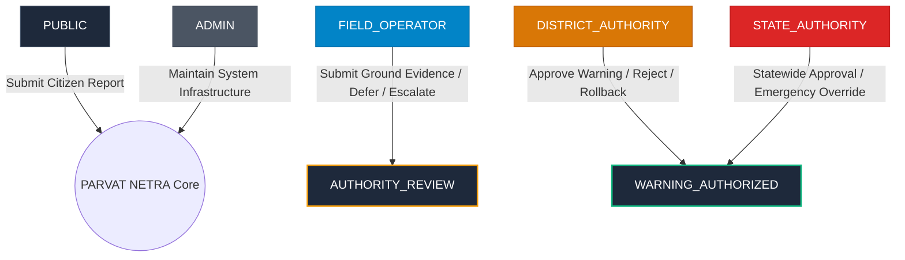

# PARVAT NETRA • PAHAD AI — PHASE 7G
## Authority Review Workflow & Emergency Dispatch Safety Gate Report

**Platform**: PARVAT NETRA — NER Sentinel  
**AI Subsystem**: PAHAD AI (Predictive AI for Hillslope Analysis & Disaster-response)  
**Pilot Corridor**: `CORR-NH10-SIKKIM-KM48` (Pakyong District, Sikkim)  
**Date**: 2026-09-11  
**Phase Status**: **AUTHORITY_WORKFLOW_VERIFIED**  

---

### 1. Executive Summary

Phase 7G establishes a strict, cryptographically verified Human-in-the-Loop (HITL) authority review workflow governing all early-warning recommendations produced by the PAHAD AI engine. 

Under the core safety doctrine:
$$\text{AI Recommendation} \neq \text{Public Emergency Alert}$$

No automated AI inference output, regardless of confidence or severity band, can directly trigger a civilian siren, dispatch mass SMS broadcasts, or push public Common Alerting Protocol (CAP v1.2) warnings without:
1. **Multi-Source Corroboration**: Independent 2-of-3 signal agreement (Physical FoS, Rainfall, ML probability).
2. **Ground Evidence Verification**: On-site responder corroboration without authority delegation.
3. **Statutory Human Authorization**: Cryptographically signed authorization token by an authenticated authority.
4. **Safety Isolation Gate**: Civilian dispatch gated by environment configuration (`PUBLIC_DISPATCH=DISABLED`) and siren relays locked in `DRY_RUN`.

---

### 2. Role-Based Access Control (RBAC) Architecture

PARVAT NETRA defines six distinct operational and administrative roles to guarantee strict separation of duties and prevent statutory overreach.



#### RBAC Permissions Matrix

| Permission Capability | PUBLIC | FIELD_OPERATOR | AUTHORITY | DISTRICT_AUTHORITY | STATE_AUTHORITY | ADMIN |
|:---|:---:|:---:|:---:|:---:|:---:|:---:|
| Receive Public Alerts | Yes | Yes | Yes | Yes | Yes | Yes |
| Submit Field Observations | Citizen Only | Verified Responder | Verified | Verified | Verified | No |
| Inspect Authority Dossier | No | Yes | Yes | Yes | Yes | Yes |
| Request Field Verification | No | Yes | Yes | Yes | Yes | No |
| Approve Warning Dispatch | **No** | **No** | Yes | **Yes** | **Yes** | **No** |
| Reject False Positive | **No** | **No** | Yes | **Yes** | **Yes** | **No** |
| Execute Alert Rollback | **No** | **No** | Yes | **Yes** | **Yes** | **No** |
| Execute Emergency Override | **No** | **No** | **No** | **Yes** (Dist) | **Yes** (State) | **No** |
| Authorize Public Dispatch | **No** | **No** | Yes | **Yes** | **Yes** | **No** |
| Trigger Physical Sirens | **No** | **No** | **No** | **No** | **No** | **No** |

*Critical Finding*: Ordinary system administrators (`ADMIN`) and field operators (`FIELD_OPERATOR`) are strictly prohibited from approving public warnings. Only statutory authorities (`DISTRICT_AUTHORITY`, `STATE_AUTHORITY`) possess legal authorization privileges. Physical sirens are strictly barred from all roles (`DRY_RUN` locked).

---

### 3. Supervised Operational State Machine

The operational state machine (`engine/operational_state_machine.py`) regulates the step-by-step progression of all incident lifecycles.

```
MONITORING
  └─> ANOMALY_DETECTED
        └─> PAHAD_EVALUATING
              └─> CORROBORATION_PENDING
                    └─> AUTHORITY_REVIEW <===============================> FIELD_RESPONSE
                          ├─> [REJECT] -----------> CANCELLED
                          ├─> [TIMEOUT] ----------> EXPIRED
                          └─> [APPROVE + TOKEN] --> WARNING_AUTHORIZED
                                                      ├─> [ROLLBACK] ----> CANCELLED
                                                      └─> PUBLIC_DISPATCH (Dry-run simulated)
                                                            └─> ACKNOWLEDGED -> RESOLVED -> CLOSED
```

#### State Transition Safety Invariants
1. **Zero Direct Jump**: AI inference cannot skip intermediate states. An alert cannot transition directly from `PAHAD_EVALUATING` or `CORROBORATION_PENDING` to `WARNING_AUTHORIZED` or `PUBLIC_DISPATCH`.
2. **Mandatory Token Interlock**: Transitions to `WARNING_AUTHORIZED` reject any execution that does not supply a valid, unexpired, non-replayed HMAC-SHA256 authorization token.
3. **Fail-Closed Terminal Protection**: Alerts already in terminal states (`RESOLVED`, `CLOSED`, `CANCELLED`) reject approval attempts.
4. **Two-Way Field Loop**: Alerts may transition between `AUTHORITY_REVIEW` and `FIELD_RESPONSE` dynamically as on-site teams gather physical evidence.

---

### 4. Canonical 18-Field Authority Review Contract

The review package synthesized by `AuthorityReviewService.create_review_package()` provides human decision-makers with an exhaustive, transparent dossier satisfying Checkpoint 7G-03:

1. `alert_id`: Unique identifier of the decision/incident.
2. `sector_id`: Geotechnical corridor segment (`CORR-NH10-SIKKIM-KM48`).
3. `created_at`: UTC timestamp of incident detection.
4. `severity`: Risk classification (`CRITICAL`, `HIGH`, `MODERATE`, `LOW`).
5. `risk_score`: Composite Risk Index (CRI, scale 0–100).
6. `model_probability`: Calibrated landslide event probability (scale 0.0–1.0).
7. `FoS`: Limit equilibrium Factor of Safety calculated from Mohr-Coulomb slope physics.
8. `rainfall`: 24-hour cumulative rainfall (mm).
9. `signal_agreement`: Corroboration fraction (`0/3`, `1/3`, `2/3`, `3/3`).
10. `evidence_summary`: Human-readable synthesis of physical telemetry, weather, and AI predictions.
11. `field_verification_status`: Status of ground inspection (`PENDING`, `DISPATCHED`, `CONFIRMED`, `UNCONFIRMED`).
12. `recommended_action`: Proposed response protocol (`EVACUATE_CORRIDOR`, `RESTRICT_HEAVY_VEHICLES`, etc.).
13. `reviewer_id`: Identification tag of the reviewing official.
14. `reviewer_role`: Administrative role of the reviewing official.
15. `decision`: Official action taken (`APPROVE`, `REJECT`, `ROLLBACK`, `OVERRIDE`, `REQUEST_FIELD_VERIFICATION`).
16. `decision_timestamp`: UTC timestamp when human decision was recorded.
17. `authorization_reference`: Cryptographic token string certifying approval.
18. `audit_hash`: SHA-256 hash linking this decision to the tamper-evident audit chain.

---

### 5. Multi-Source Corroboration Engine

Alert eligibility requires independent agreement across at least 2 of 3 distinct physical and mathematical modalities:

$$\text{Alert Eligible} \iff \sum_{i=1}^3 \mathbb{I}(\text{Signal}_i = \text{CONFIRMED}) \ge 2$$

| Modality | Measured Parameter | Threshold | Confirmed Condition | Provenance Tracking |
|:---|:---|:---|:---|:---|
| **PHYSICAL** | Limit Equilibrium FoS | $< 1.10$ | Limit equilibrium failure imminent | MODELLED / SIMULATED |
| **RAINFALL** | 24h Cumulative Precipitation | $> 150.0\text{ mm}$ | Geotechnical saturation exceeded | LIVE (Open-Meteo) |
| **ML EVENT** | Calibrated Failure Probability | $> 0.70\text{ (70\%)}$ | GBDT event classification ceiling | MODELLED |

- **0/3 or 1/3 Agreement**: Alert ineligible. Public warning dispatch physically prevented.
- **2/3 Agreement**: Alert eligible for human authority review. Auto-dispatch strictly blocked.
- **3/3 Agreement**: Highest confidence alert. Mandatory human authority sign-off still required.

---

### 6. Verification and Test Results

| Test Suite | File | Tests | Pass Rate |
|:---|:---|:---:|:---:|
| RBAC Role Permissions | `tests/test_phase7g_rbac.py` | 7 | 100% |
| Lifecycle State Machine | `tests/test_phase7g_state_machine.py` | 6 | 100% |
| Authority Review & Token Auth | `tests/test_phase7g_authorization.py` | 10 | 100% |
| Multi-Source Corroboration Gate | `tests/test_phase7g_corroboration.py` | 7 | 100% |
| Review Timeout & Escalation | `tests/test_phase7g_timeout.py` | 3 | 100% |
| Warning Rollback & Withdrawal | `tests/test_phase7g_rollback.py` | 3 | 100% |
| OASIS CAP v1.2 & Notifications | `tests/test_phase7g_cap.py` | 5 | 100% |
| Tamper-Evident Audit Chaining | `tests/test_phase7g_audit.py` | 2 | 100% |
| Fail-Closed Drills & Overrides | `tests/test_phase7g_fail_closed.py` | 3 | 100% |
| **Total Phase 7G Targeted** | **9 Suites** | **46** | **100%** |
| Pre-Existing Regression Suites | `tests/test_phase7f_*.py` + `test_phase7_*.py` | 43 | 100% |
| **Grand Total Verified** | **All Phase 7 Suites** | **89** | **100%** |
