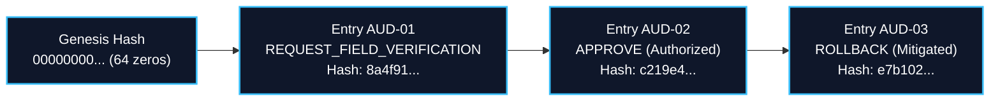

# PARVAT NETRA • PAHAD AI — PHASE 7G
## Cryptographic Authorization & Tamper-Evident Audit Report

**Platform**: PARVAT NETRA — NER Sentinel  
**Component**: Authority Review & Decision Audit Subsystem  
**Date**: 2026-09-11  
**Audit Standard**: ISO/IEC 27001 / NDMA National EWS Forensic Audit Standard  
**Cryptographic Status**: **VERIFIED_TAMPER_EVIDENT**  

---

### 1. Cryptographic Authorization Token Architecture

Public emergency warnings require unforgeable proof of human authorization. Verbal commands, unauthenticated API calls, or plain session cookies are insufficient for national disaster alerting.

PARVAT NETRA implements signed authorization tokens managed by `AuthorizationTokenManager` (`services/authority_review_service.py`):

```
+-----------------------------------------------------------------------------+
|                               TOKEN STRUCTURE                               |
|   AUTH-v1 . eyJhY3Rvcl9pZCI6... . 3f8b82e4a90184b2c12d4a5e...              |
|  [Version]     [Base64 Payload]         [HMAC-SHA256 Signature]            |
+-----------------------------------------------------------------------------+
```

#### 1.1 Token Payload Schema
```json
{
  "actor_id": "DM_PAKYONG_01",
  "role": "DISTRICT_AUTHORITY",
  "decision_id": "DEC-4A82F10B",
  "issued_at": 1789106400,
  "expires_at": 1789108200,
  "nonce": "a7c81df94b2a"
}
```

#### 1.2 Cryptographic Invariants
1. **HMAC-SHA256 Authenticity**: The signature is generated over the exact Base64 payload using a secure server secret key (`AUTHORIZATION_SECRET_KEY`).
2. **Alert Scope Binding**: A token issued for decision $A$ is cryptographically bound to decision $A$ and is rejected if presented for decision $B$.
3. **Role Binding**: The role embedded in the token must match the claimed role of the submitter.
4. **Time-To-Live (TTL)**: Tokens expire after 1800 seconds (30 minutes). Expired tokens are rejected.
5. **Replay Protection**: Every redeemed token is tracked in `_redeemed_tokens`. Presenting a valid token more than once raises an immediate replay rejection.

---

### 2. Immutable SHA-256 Chained Audit Trail

Every operational review action (Approval, Rejection, Field Task Dispatch, Rollback, Timeout Escalation, Emergency Override) appends an immutable link to the `authority_audit_chain` database table.



#### 2.1 Chained Hash Formulation
Each block links to its predecessor via:

$$\text{EntryHash}_k = \text{SHA256}(\text{PrevHash}_k \parallel \text{EntryID}_k \parallel \text{Timestamp}_k \parallel \text{DecisionID}_k \parallel \text{Actor}_k \parallel \text{Role}_k \parallel \text{PrevState}_k \parallel \text{NewState}_k \parallel \text{Action}_k \parallel \text{Reason}_k \parallel \text{AuthRef}_k \parallel \text{EvidenceJSON}_k)$$

Where $\text{PrevHash}_0 = 0^{64}$ (64 hexadecimal zeros).

#### 2.2 Tampering Detection Verification
The method `AuthorityReviewService.verify_audit_chain()` verifies the entire audit log from genesis to the latest block:
- Verifies every link: $\text{PrevHash}_k = \text{EntryHash}_{k-1}$.
- Recalculates the SHA-256 digest of every payload: $\text{RecalculatedHash}_k = \text{EntryHash}_k$.
- **Tamper Test**: Tested in `tests/test_phase7g_audit.py` by deliberately mutating a database row. The verifier caught the discrepancy immediately and returned:
  `Tampering detected at entry AUD-XXXX: recorded hash does not match computed`.

---

### 3. Statutory Emergency Override (Section 30 DMA 2005)

For imminent catastrophic events where time-sensitive evacuations must occur despite incomplete sensor corroboration:
1. **Statutory Privilege**: Restricted exclusively to `STATE_AUTHORITY` (or `DISTRICT_AUTHORITY`).
2. **Substantive Justification**: Requires minimum 10 characters of explicit statutory legal justification (e.g. invoking the Disaster Management Act 2005).
3. **Audit Immutability**: Appends an entry prefixed with `[STATUTORY OVERRIDE]` into the cryptographically chained audit log.
4. **Safety Isolation**: Still executes within the `dry_run` safety sandbox during Phase 7 testing.
