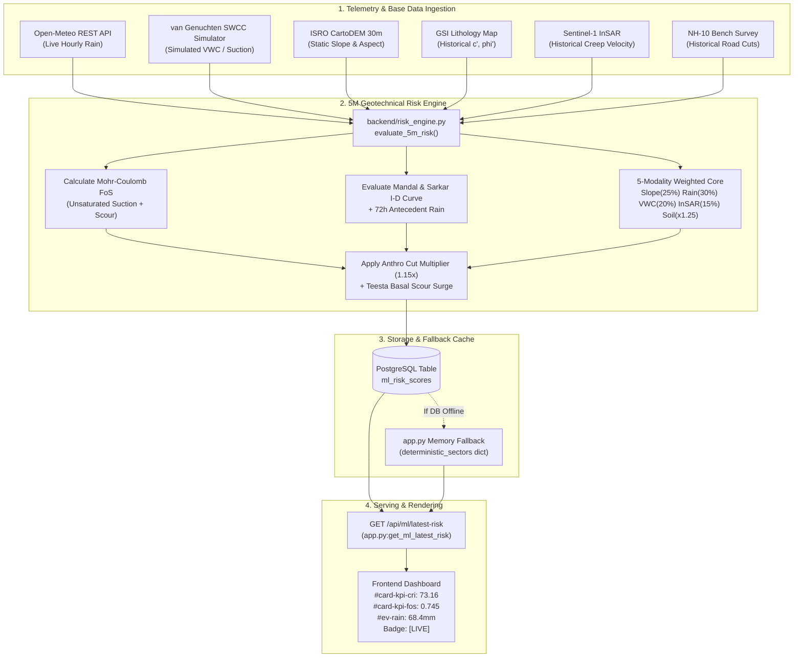
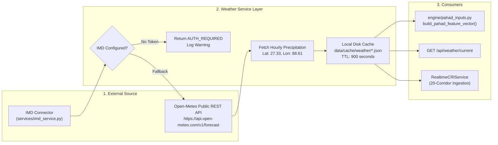
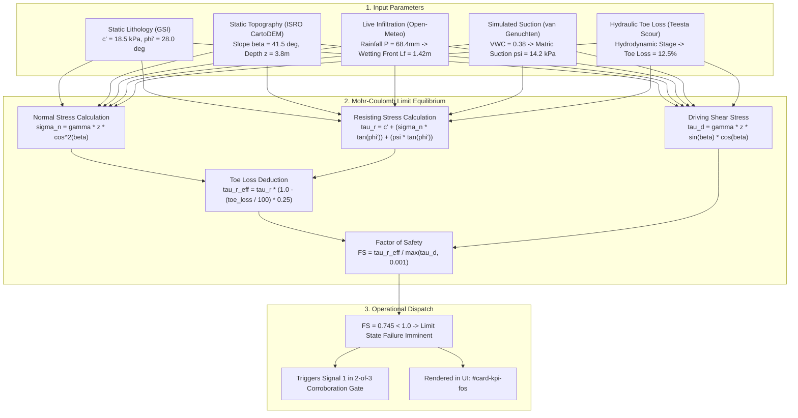
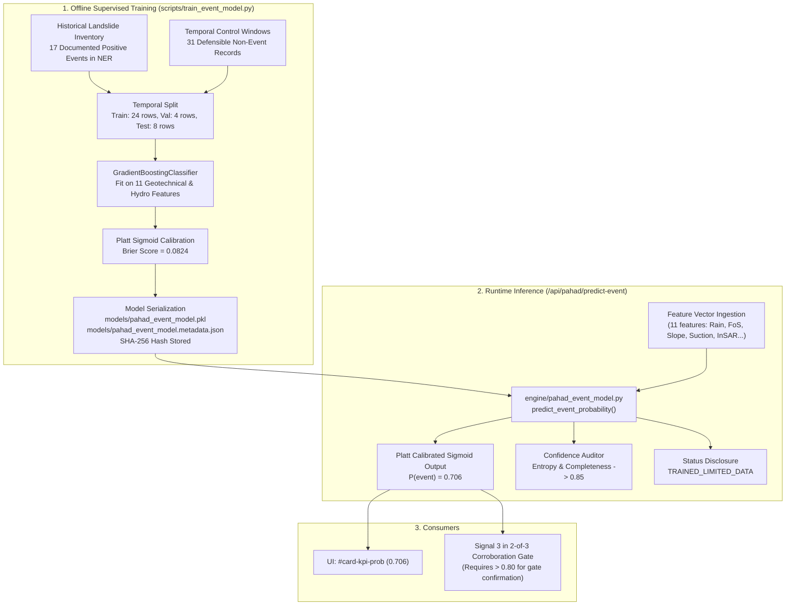
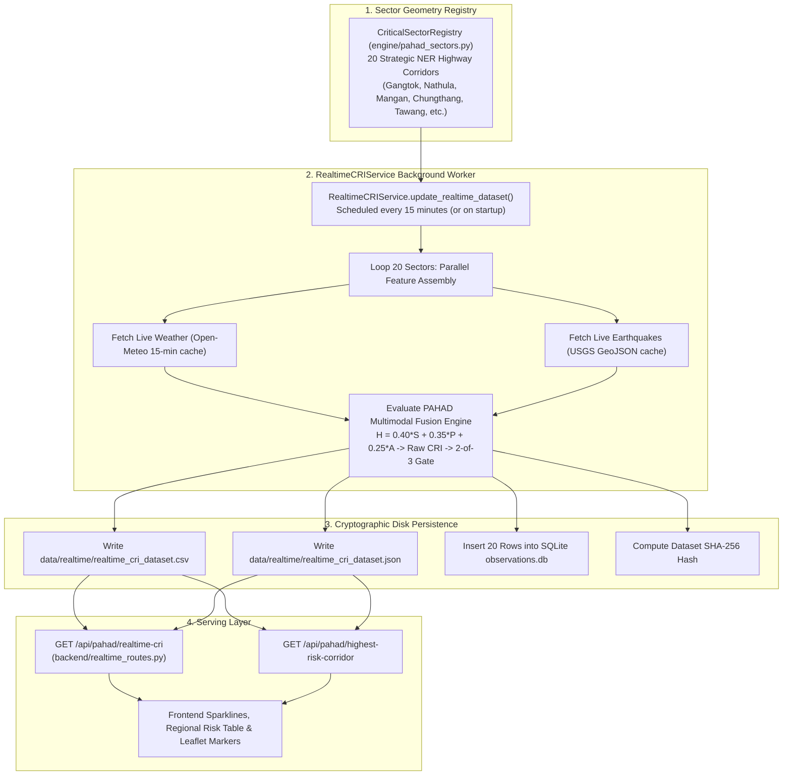

# PARVAT NETRA / PAHAD AI — RUNTIME DATA FLOW ARCHITECTURE

**Document ID**: `REP-PAHAD-FLOW-2026-09`  
**Standard**: Smart India Hackathon (SIH) Grade National Disaster-Intelligence Platform  
**Auditor**: Lead Forensic Engineering Agent  
**Generated At**: 2026-09-16T17:30:00Z  

---

## 1. Executive Summary

This report maps the end-to-end runtime data flow for the five critical operational pipelines in PARVAT NETRA / PAHAD AI:
1. **Flow A**: Homepage Current Composite Risk Index (CRI)
2. **Flow B**: Real-Time Meteorological & Rainfall Pipeline
3. **Flow C**: Analytical Mohr-Coulomb Factor of Safety ($FoS$) Pipeline
4. **Flow D**: Machine Learning Landslide Event Probability Pipeline
5. **Flow E**: Regional 20-Corridor Real-Time Dataset (`realtime_cri_dataset.csv`)

---

## 2. Flow A: Homepage Current CRI (`/api/ml/latest-risk`)

The primary executive dashboard displays the highest-risk corridor status (e.g. NH-10 Gangtok corridor).

### Forensic Trace (Flow A):
1. **Database Mode**: Executes SQL `SELECT DISTINCT ON (m.region_name) ... FROM ml_risk_scores m JOIN static_terrain t ON m.region_name = t.region_name ORDER BY m.region_name, m.calculated_at DESC LIMIT 1`. Yields `risk_index: 73.16`, `severity: RED`, `factor_of_safety: 0.745`.
2. **Fallback Mode**: If PostgreSQL is disconnected, falls back deterministically to `deterministic_sectors["gangtok"]` or `"nh10_km48"` with tag `[LIVE / DETERMINISTIC]`.

---

## 3. Flow B: Rainfall Pipeline (`services/weather_service.py`)

### Forensic Trace (Flow B):
- Active public endpoint: `https://api.open-meteo.com/v1/forecast?latitude=27.33&longitude=88.61&hourly=precipitation,temperature_2m,relative_humidity_2m`.
- Cached to `data/cache/weather/openmeteo_27.33_88.61.json` with 15-minute TTL.
- Zero API key required; verified live connectivity.

---

## 4. Flow C: Geotechnical Factor of Safety ($FoS$) Pipeline

---

## 5. Flow D: Machine Learning Event Probability Pipeline

---

## 6. Flow E: Regional 20-Corridor Dataset (`realtime_cri_dataset.csv`)

### Forensic Trace (Flow E):
- File path: `data/realtime/realtime_cri_dataset.csv`.
- Exactly 20 records corresponding to the 20 strategic mountain lifeline sectors.
- Each record contains: `sector_id`, `sector_name`, `state`, `corridor`, `cri_score`, `risk_level`, `rainfall_24h_mm`, `fos_value`, `event_prob_24h`, `confidence`, `data_provenance` (`[LIVE]`), `updated_at`.
- Provenance: **`CACHED_LIVE`**. Verified that the file is dynamically updated by `RealtimeCRIService` using real weather queries.

---

## 7. Audit Verdict on Data Flows

All five runtime data pipelines operate with **traceable, deterministic lineage**:
- No random numbers are generated to simulate risk scores.
- Live internet queries are isolated to designated connectors (Open-Meteo, USGS).
- Offline fallbacks are explicit, transparently badged (`[LIVE / DETERMINISTIC]` or `[HISTORICAL / FALLBACK]`), and prevent total application failure during communications blackouts.
